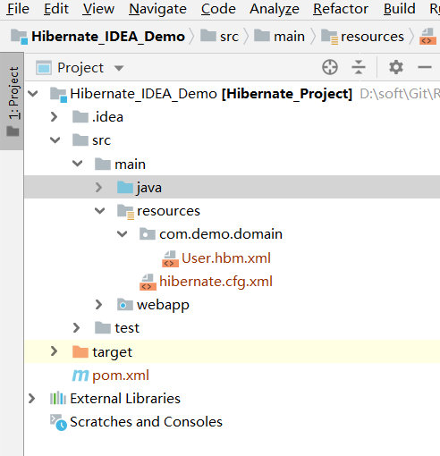
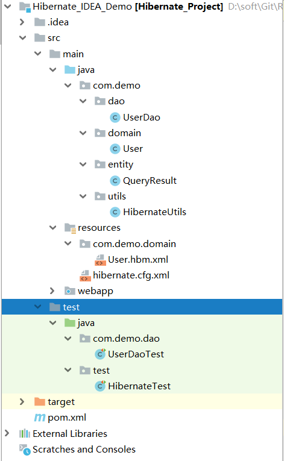

## IDEA搭建Hibernate教程

[入门搭建教程](https://blog.csdn.net/weixin_44486072/article/details/90106174)

### 一、注意事项：

```xml
<!-- 配置hibernate的映射文件所在的位置,注意前面的包路径采用"."，类路径采用"/" -->
<mapping resource="com.demo.domain/User.hbm.xml"/>
```



### 二、创建Maven工程，完整架构目录如下



### 三、POM.xml

```xml
<dependencies>
    <dependency>
      <groupId>org.hibernate</groupId>
      <artifactId>hibernate-core</artifactId>
      <version>5.4.2.Final</version>
    </dependency>
    <dependency>
      <groupId>mysql</groupId>
      <artifactId>mysql-connector-java</artifactId>
      <version>5.1.38</version>
    </dependency>
    <dependency>
      <groupId>junit</groupId>
      <artifactId>junit</artifactId>
      <version>4.12</version>
    </dependency>
  </dependencies>
```


### 四、 **核心配置文件hibernate.cfg.xml** 

```xml
<?xml version="1.0" encoding="UTF-8"?>
<!DOCTYPE hibernate-configuration PUBLIC
        "-//Hibernate/Hibernate Configuration DTD 3.0//EN"
        "http://www.hibernate.org/dtd/hibernate-configuration-3.0.dtd">
<hibernate-configuration>
    <session-factory>
        <!-- 配置关于数据库连接的四个项：driverClass  url username password -->
        <property name="hibernate.connection.driver_class">com.mysql.jdbc.Driver</property>
        <property name="hibernate.connection.url">jdbc:mysql:///hibernate?useUnicode=true&amp;characterEncoding=UTF-8</property>
        <property name="hibernate.connection.username">root</property>
        <property name="hibernate.connection.password">12345678</property>

        <!-- 可以将向数据库发送的SQL语句显示出来 -->
        <property name="hibernate.show_sql">true</property>
        <!-- 格式化SQL语句 -->
        <property name="hibernate.format_sql">true</property>
        <!-- hibernate的方言 -->
        <property name="hibernate.dialect">org.hibernate.dialect.MySQLDialect</property>
        <!--  数据库方言  -->
        <!--<property name="dialect">org.hibernate.dialect.MySQLDialect</property>-->
        <!--// 5.0之后使用的数据库方言-->
        <property name="dialect">org.hibernate.dialect.MySQL5Dialect</property>
        <!--  显示sql语句  -->
        <property name="show_sql">true</property>
        <!--  格式化sql语句  -->
        <property name="format_sql">true</property>
        <property name="hbm2ddl.auto">update</property>
        <!-- 配置hibernate的映射文件所在的位置 -->
        <mapping resource="com.demo.domain/User.hbm.xml"/>
    </session-factory>
</hibernate-configuration>
```


### 五、 **实体类com.demo.domain.User** 

### 六、 **映射文件com/demo/domain/User.hbm.xml** 

```xml
<?xml version="1.0" encoding="UTF-8"?>
<!DOCTYPE hibernate-mapping PUBLIC
        "-//Hibernate/Hibernate Mapping DTD 3.0//EN"
        "http://www.hibernate.org/dtd/hibernate-mapping-3.0.dtd">
<hibernate-mapping package="com.demo.domain">
    <!--
        name：即实体类的全名
        table：映射到数据库里面的那个表的名称
        catalog：数据库的名称
     -->
    <class name="User" table="tb_user" catalog="hibernate">
        <!-- class下必须要有一个id的子元素 -->
        <!-- id是用于描述主键的 -->
        <id name="id" column="id">
            <!-- 主键生成策略 -->
            <generator class="native"/>
        </id>
        <!--
            使用property来描述属性与字段的对应关系
            如果length忽略不写，且你的表是自动创建这种方案，那么length的默认长度是255
        -->
        <property name="username" column="username" length="20"/>
        <property name="birthday" column="birthday" length="20"/>
        <property name="sex" column="sex" length="2"/>
        <property name="address" column="address" length="50"/>
    </class>
</hibernate-mapping>

```

