## 一、使用IDEA通过Maven搭建Struts2教程

[学习网站](https://blog.csdn.net/xudailong_blog/article/details/84305984)

[Tomcat乱码](https://blog.csdn.net/Yuz_99/article/details/89812239)

[Tomcat配置](https://www.cnblogs.com/Miracle-Maker/articles/6476687.html)

### 1.创建项目

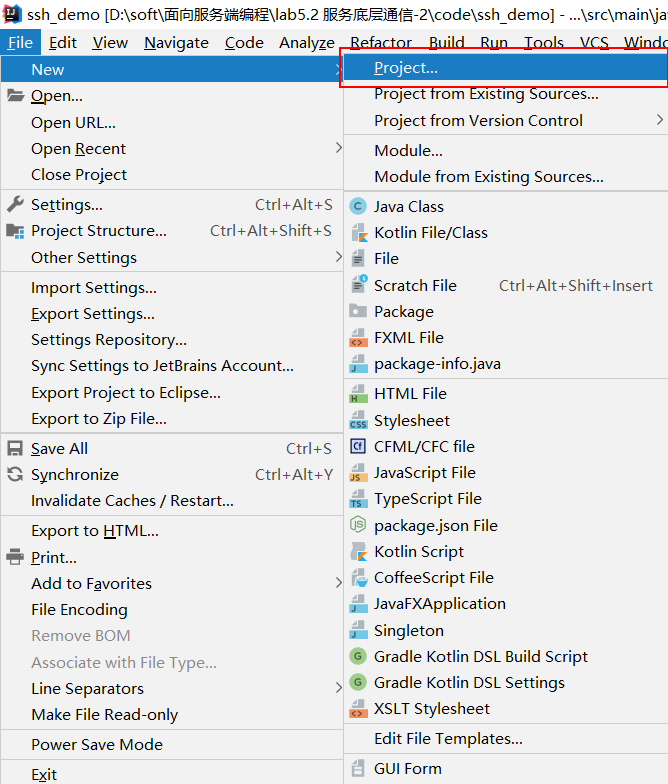


### 2.选择Maven项目

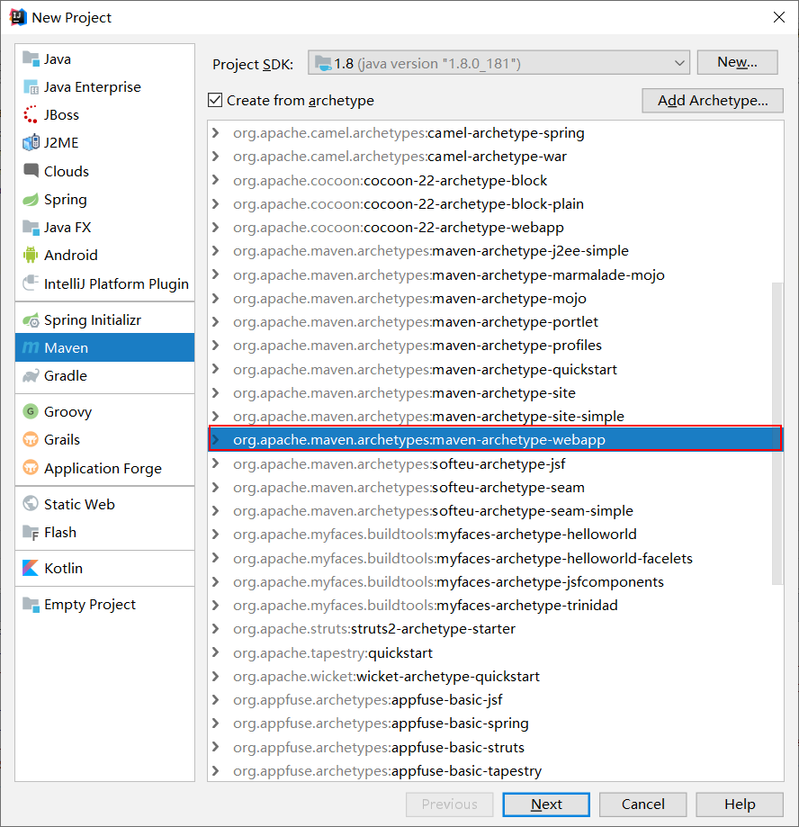


### 3. GoupId - ArtifactId 

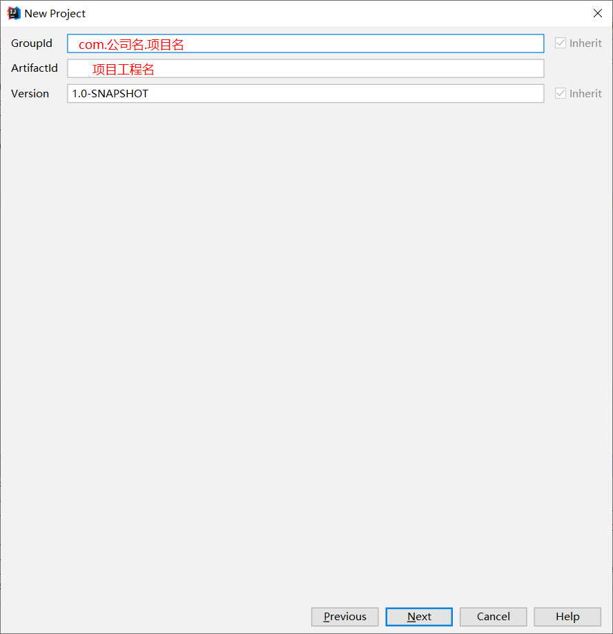 


### 4.Maven仓库设置

> 注意Maven路径是否正确.

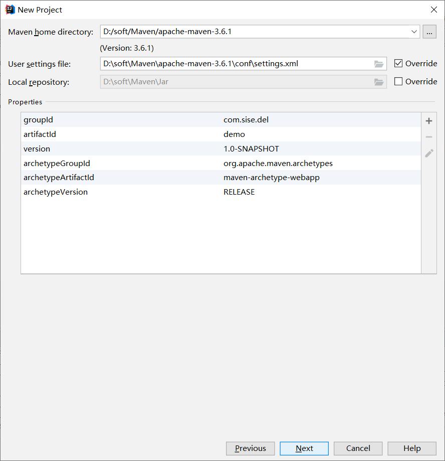


### 5.Pom文件配置Struts2

```
commons-fileupload-1.2.2.jar 【文件上传相关包】
commons-io-2.0.1.jar
struts2-core-2.3.4.1.jar 【struts2核心功能包】
ognl-3.0.5.jar 【Ognl表达式功能支持表】
commons-lang3-3.1.jar 【struts对java.lang包的扩展】
freemarker-2.3.19.jar 【struts的标签模板库jar文件】
javassist-3.11.0.GA.jar 【struts对字节码的处理相关jar】
```

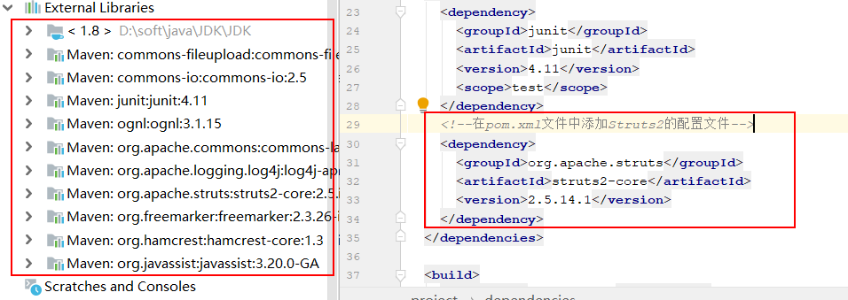


### 6.Web.xml引入Struts2核心功能

```xml
<!--引入struts2过滤器-->
  <filter>
    <filter-name>struts2</filter-name>
   	<filterclass>
        org.apache.struts2.dispatcher.filter.StrutsPrepareAndExecuteFilter
    </filter-class>
  </filter>

  <filter-mapping>
    	<filter-name>struts2</filter-name>
   		<url-pattern>/*</url-pattern>
  </filter-mapping>

  <welcome-file-list>
    <welcome-file>index.jsp</welcome-file>
  </welcome-file-list>
```

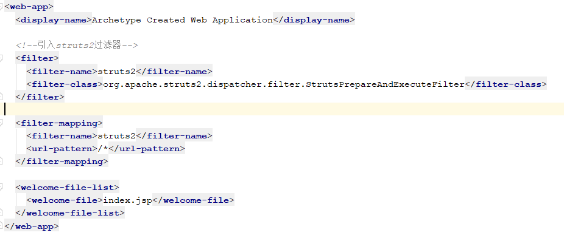


### 7.整体目录结构

````
自己创建java，resources目录
java -->SourcesRoot
resources --> Resources Root
````

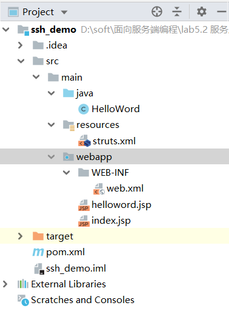

### 8.Struts.xml文件配置

```xml
<?xml version="1.0" encoding="UTF-8"?>
<!DOCTYPE struts PUBLIC
        "-//Apache Software Foundation//DTD Struts Configuration 2.5//EN"
        "http://struts.apache.org/dtds/struts-2.5.dtd">
<struts>
    <package name="null" extends="struts-default">
        <action name="helloWord" class="com.sise.HelloWordAction" method="helloWord">
            <result name="success">helloword.jsp</result>
        </action>
    </package>
</struts>

```


## 二、Tomcat的配置部署

### 1.配置Tomcat

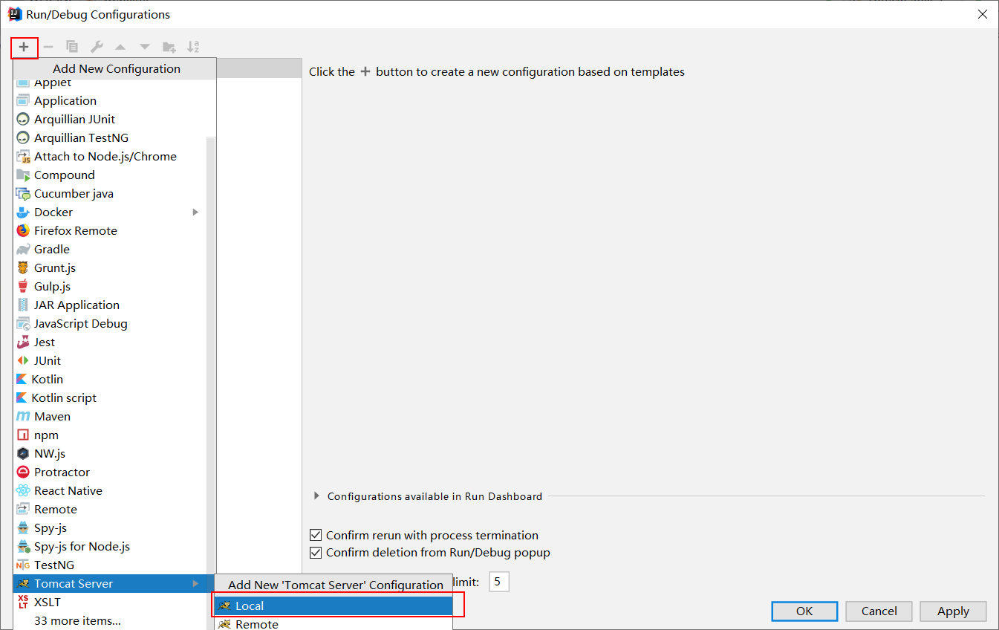


### 2.导入War包，注意路径

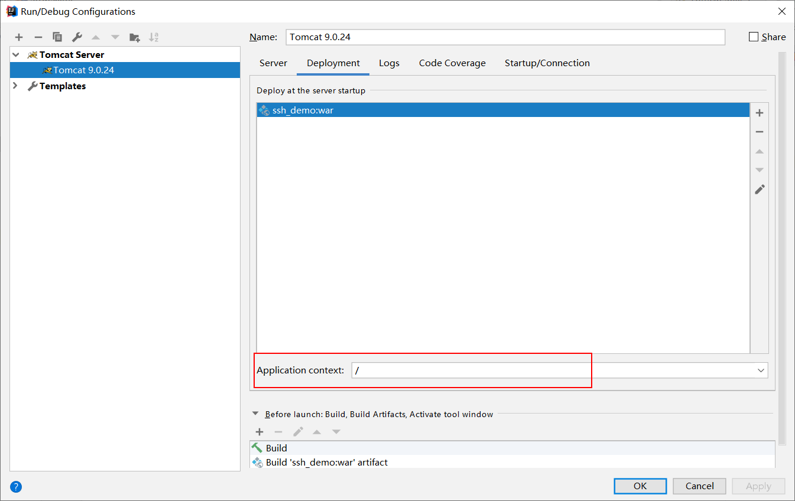


### 3.网址请求

```
由于上面Tomcat的路径设置了"/"，故此省略了虚拟项目名称.
```

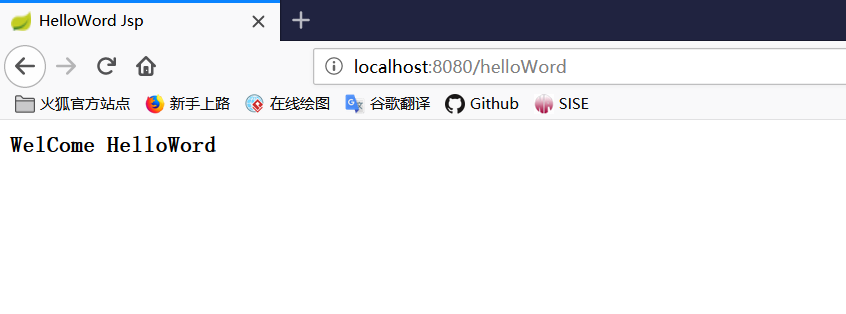


## 三、Tomcat控制台乱码

```
-Dfile.encoding=UTF-8
```

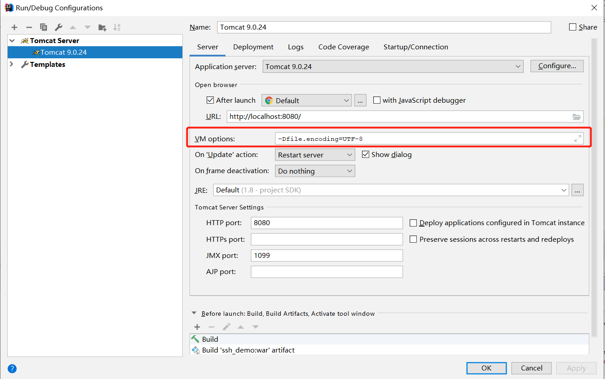