# 并发编程个人总结

## 1、进程与线程

### 进程

* 程序由指令和数据组成，但这些指令要运行，数据要读写，就必须将指令加载至 CPU，数据加载至内存。在指令运行过程中还需要用到磁盘、网络等设备。进程就是用来加载指令、管理内存、管理 IO 的 
*  当一个程序被运行，从磁盘加载这个程序的代码至内存，这时就开启了一个进程 
*  进程就可以视为程序的一个实例。大部分程序可以同时运行多个实例进程（例如记事本、画图、浏览器等），也有的程序只能启动一个实例进程（例如网易云音乐、360 安全卫士等） 

### 线程

-  一个进程之内可以分为一到多个线程 
-  一个线程就是一个指令流，将指令流中的一条条指令以一定的顺序交给 CPU 执行 
-  Java 中，线程作为最小调度单位，进程作为资源分配的最小单位。在 windows 中进程是不活动的，只是作为线程的容器 

### 二者对比

* 进程基本上相互独立的，而线程存在于进程内，是进程的一个子集
* 进程拥有共享的资源，如 **内存空间** 等，供其内部的线程共享
* 进程间通信较为复杂：
  * 同一台计算机的进程通信称为 IPC（Inter-process communication）
  * 不同计算机之间的进程通信，需要通过网络，并遵守共同的协议，例如 HTTP
* 线程通信相对简单，因为它们共享进程内的内存，一个例子是多个线程可以访问同一个共享变量
* 线程更轻量，线程上下文切换成本一般上要比进程上下文切换低 


## 2、并发与并行

 ### 并发

并发（concurrent）是同一时间应对（dealing with）多件事情的能力。 

单核 cpu 下，线程实际还是串行执行的。操作系统中有一个组件叫做任务调度器，将 cpu 的时间片（windows下时间片最小约为 15 毫秒）分给不同的程序使用，只是由于 cpu 在线程间（时间片很短）的切换非常快，人类感觉是同时运行的。总结为一句话就是：**微观串行，宏观并行 **

 一般会将这种线程 **轮流使用CPU** 的做法称为并发， concurrent 

### 并行

并行（parallel）是同一时间动手做（doing）多件事情的能力 

### 同步与异步

需要等待结果返回，才能继续运行就是同步 

不需要等待结果返回，就能继续运行就是异步 


## 3、Java线程

### 创建与运行线程

**直接使用Thread**：创建线程对象 、启动线程

**使用Runnable配合Thread**：把【线程】和【任务】（要执行的代码）分开、 Thread 代表线程、 Runnable 可运行的任务（线程要执行的代码） 

**FutureTask配合Thread**： FutureTask 能够接收 Callable 类型的参数，用来处理有返回结果的情况 


### 查看进程线程的方法

window： tasklist（查看进程）、taskkill（杀死进程）

linux：ps -fe（查看所有进程）、kill（杀死进程）  

java：jps（ 查看所有 Java 进程 ）、jstack（查看某个Java进程PID的所有线程状态）、jconsole（以图形界面查看某个Java进程中线程的运行情况）


### 线程运行原理

**栈与栈帧**

一个线程拥有一个私有虚拟机栈；一个虚拟机栈可以拥有多个栈帧；一个栈帧对应一个方法的调用；线程可以调用多个方法，每调用一个方法，就将方法信息以栈帧方式压栈。

**线程上线文切**

因为以下一些原因导致 cpu 不再执行当前的线程，转而执行另一个线程的代码 

*  线程的 cpu 时间片用完 
* 垃圾回收
* 有更高优先级的线程需要运行
* 线程自己调用了sleep、yield、wait、join、prak、synchronized、lock等方法

 当 Context Switch 发生时，需要由操作系统保存当前线程的状态，并恢复另一个线程的状态，Java 中对应的概念就是程序计数器（Program Counter Register），它的作用是记住下一条 jvm 指令的执行地址，是线程私有的 

* 状态包括程序计数器、虚拟机栈中每个栈帧的信息，如局部变量、操作数栈、返回地址等 
* Context Switch 频繁发生会影响性能 


### start 与 run 

start 方法只是让线程进入就绪，里面代码不一定立刻运行（CPU 的时间片还没分给它）。每个线程对象的start方法只能调用一次，如果调用了多次会出现IllegalThreadStateException 

### sleep 与 yield 

sleep

*  调用 sleep 会让当前线程从Running进入Timed Waiting状态（阻塞 
*  其它线程可以使用  interrupt 方法打断正在睡眠的线程，这时 sleep 方法会抛出InterruptedException
*  睡眠结束后的线程未必会立刻得到执行 
*  建议用 TimeUnit 的 sleep 代替 Thread 的 sleep 来获得更好的可读性 

yield

*  调用 yield 会让当前线程从Running进入Runnable就绪状态，然后调度执行其它线程 
*  具体的实现依赖于操作系统的任务调度器 

### join

 等待线程运行结束 

### interrupt

打断 sleep，wait，join 的线程， 这几个方法都会让线程进入阻塞状态 

*  打断 sleep 的线程, 会清空打断状态 
*  打断正常运行的线程, 不会清空打断状态 
*  打断 park 线程, 不会清空打断状态 

### 不推荐的方法

这些方法已过时，容易破坏同步代码块，造成线程死锁 ：

stop() 、suspend()、resume()

### 主线程与守护线程

默认情况下，Java 进程需要等待所有线程都运行结束，才会结束。

有一种特殊的线程叫做守护线程，只要其它非守护线程运行结束了，即使守护线程的代码没有执行完，也会强制结束 

>*  垃圾回收器线程就是一种守护线程 
>
>*  omcat 中的 Acceptor 和 Poller 线程都是守护线程，所以 Tomcat 接收到 shutdown 命令后，不会等待它们处理完当前请求 

### 五种状态

初始状态、可运行状态、运行状态、阻塞状态、终止状态

*  【初始状态】仅是在语言层面创建了线程对象，还未与操作系统线程关联 
*  【可运行状态】（就绪状态）指该线程已经被创建（与操作系统线程关联），可以由 CPU 调度执行 
*  【运行状态】指获取了 CPU 时间片运行中的状态 
  * 当 CPU 时间片用完，会从【运行状态】转换至【可运行状态】，会导致线程的上下文切换 
*  【阻塞状态】 
  *  如果调用了阻塞 API，如 BIO 读写文件，这时该线程实际不会用到 CPU，会导致线程上下文切换，进入【阻塞状态】 
  *  等 BIO 操作完毕，会由操作系统唤醒阻塞的线程，转换至【可运行状态】 
  *  与【可运行状态】的区别是，对【阻塞状态】的线程来说只要它们一直不唤醒，调度器就一直不会考虑调度它们 

*  【终止状态】表示线程已经执行完毕，生命周期已经结束，不会再转换为其它状态 

### 六种状态


## 4、共享模型值管程

### 临界区

*  一个程序运行多个线程本身是没有问题的 
*  问题出在多个线程访问**共享资源** 
  *  多个线程读共享资源其实也没有问题 
  *  在多个线程对共享资源读写操作时发生**指令交错**，就会出现问题 

*  一段代码块内如果存在对**共享资源**的多线程读写操作，称这段代码块为**临界区** 


###  竞态条件 

多个线程在临界区内执行，由于代码的执行序列不同而导致结果无法预测，称之为发生了竞态条件 


###  synchronized 解决方案 

应用之互斥 ：本次课使用阻塞式的解决方案：synchronized，来解决上述问题，即俗称的【对象锁】，它采用互斥的方式让同一时刻至多只有一个线程能持有【对象锁】，其它线程再想获取这个【对象锁】时就会阻塞住。这样就能保证拥有锁的线程可以安全的执行临界区内的代码，不用担心线程上下文切换

>  虽然 java 中互斥和同步都可以采用 synchronized 关键字来完成，但它们还是有区别的： 
>
> *  互斥是保证临界区的竞态条件发生，同一时刻只能有一个线程执行临界区代码 
> *  同步是由于线程执行的先后、顺序不同、需要一个线程等待其它线程运行到某个点 

```java
synchronized(对象) // 线程1，线程2(blocked)
{
    临界区
}
```

 不加 synchronized 的方法 : 不加 synchronzied 的方法就好比不遵守规则的人，不去老实排队（好比翻窗户进去的） 


###  变量的线程安全分析 

**成员变量和静态变量是否线程安全?**

*  如果它们没有共享，则线程安全 
*  如果它们被共享了，根据它们的状态是否能够改变，又分两种情况 
  *  如果只有读操作，则线程安全 
  *  如果有读写操作，则这段代码是临界区，需要考虑线程安全 

**局部变量是否线程安全?**

*  局部变量是线程安全的 
*  但局部变量引用的对象则未必 
  *  如果该对象没有逃离方法的作用访问，它是线程安全的 
  *  如果该对象逃离方法的作用范围，需要考虑线程安全 


###  常见线程安全类

* String
* Integer
* StringBuffer
* Random
* Vector
* Hashtable
* java.util.concurrent 包下的类 

这里说它们是线程安全的是指，多个线程调用它们同一个实例的某个方法时，是线程安全的。 

> 它们的每个方法是原子的 
>
> 但注意它们多个方法的组合不是原子的 


###  Monitor 概念 

**Java 对象头** 

普通对象 

```java
|--------------------------------------------------------------|
|                      ObjectHeader (64bits)                   |
|------------------------------------|-------------------------|
|         MarkWord (32bits)          |    KlassWord (32bits)   |
|------------------------------------|------------------------ |
```

 数组对象 

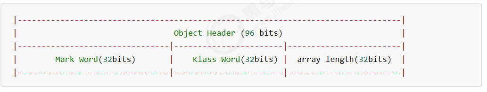

 64 位虚拟机 Mark Word 

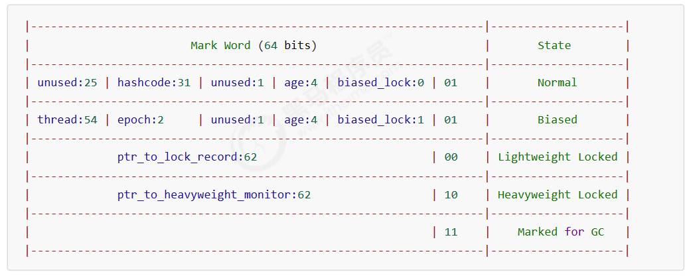

Monitor 被翻译为**监视器或管程**

每个 Java 对象都可以关联一个 Monitor 对象，如果使用 synchronized 给对象上锁（重量级）之后，该对象头的Mark Word 中就被设置指向 Monitor 对象的指针 

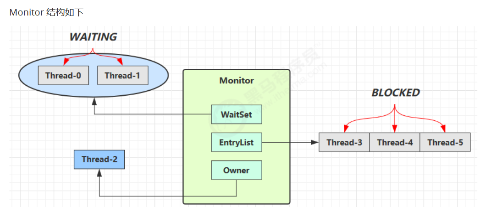

*  刚开始 Monitor 中 Owner 为 null
* 当 Thread-2 执行 synchronized(obj) 就会将 Monitor 的所有者 Owner 置为 Thread-2，Monitor中只能有一个 Owner
* 在 Thread-2 上锁的过程中，如果 Thread-3，Thread-4，Thread-5 也来执行 synchronized(obj)，就会进入EntryList BLOCKED
* Thread-2 执行完同步代码块的内容，然后唤醒 EntryList 中等待的线程来竞争锁，竞争的时是非公平的
* 图中 WaitSet 中的 Thread-0，Thread-1 是之前获得过锁，但条件不满足进入 WAITING 状态的线程，后面讲wait-notify 时会分析 


###  synchronized 原理 

**1. 轻量级锁 **

轻量级锁的使用场景：如果一个对象虽然有多线程要加锁，但加锁的时间是错开的（也就是没有竞争），那么可以使用轻量级锁来优化。轻量级锁对使用者是透明的，即语法仍然是synchronized 

*  创建锁记录（Lock Record）对象，每个线程都的栈帧都会包含一个锁记录的结构，内部可以存储锁定对象的Mark Word 

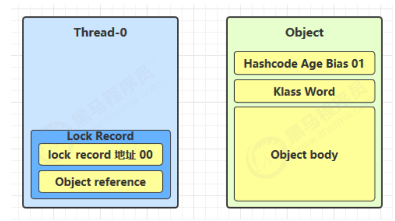

*  让锁记录中 Object reference 指向锁对象，并尝试用 cas 替换 Object 的 Mark Word，将 Mark Word 的值存入锁记录 

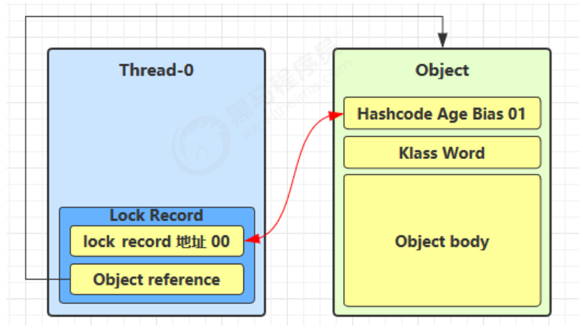

*  如果 cas 替换成功，对象头中存储了锁记录地址和状态 00，表示由该线程给对象加锁，这时图示如下 

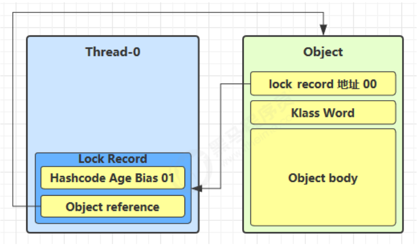

*  如果 cas 失败，有两种情况 
  *  如果是其它线程已经持有了该 Object 的轻量级锁，这时表明有竞争，进入锁膨胀过程 
  *  如果是自己执行了 synchronized 锁重入，那么再添加一条 Lock Record 作为重入的计数 

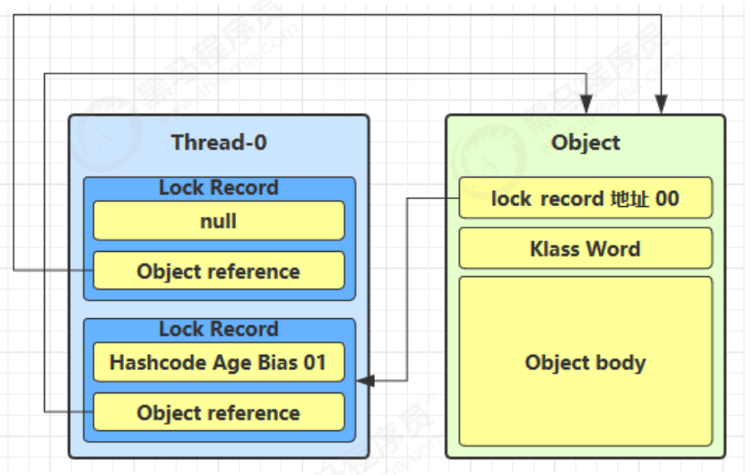

*  当退出 synchronized 代码块（解锁时）如果有取值为 null 的锁记录，表示有重入，这时重置锁记录，表示重入计数减一 

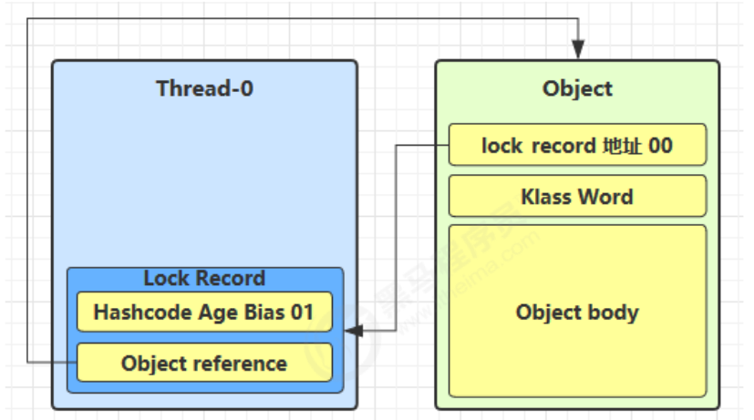

*  当退出 synchronized 代码块（解锁时）锁记录的值不为 null，这时使用 cas 将 Mark Word 的值恢复给对象头 
  *  成功，则解锁成功 
  *  失败，说明轻量级锁进行了锁膨胀或已经升级为重量级锁，进入重量级锁解锁流程 


**2. 锁膨胀 **

如果在尝试加轻量级锁的过程中，CAS 操作无法成功，这时一种情况就是有其它线程为此对象加上了轻量级锁（有竞争），这时需要进行锁膨胀，将轻量级锁变为重量级锁 

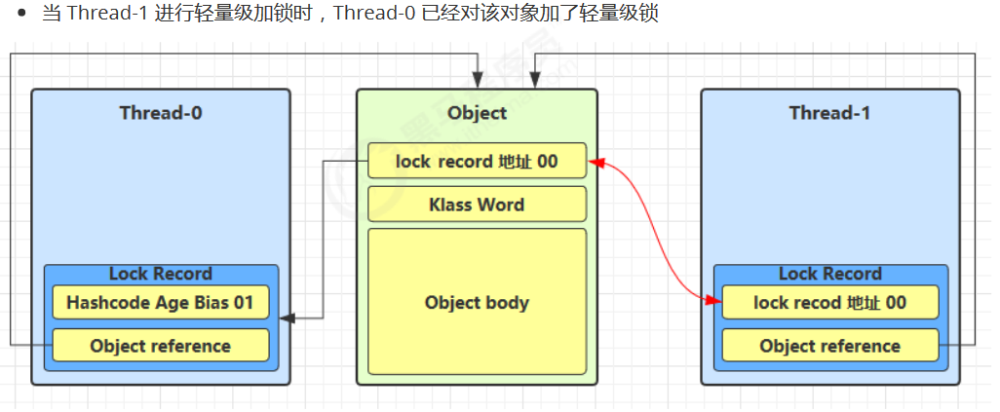

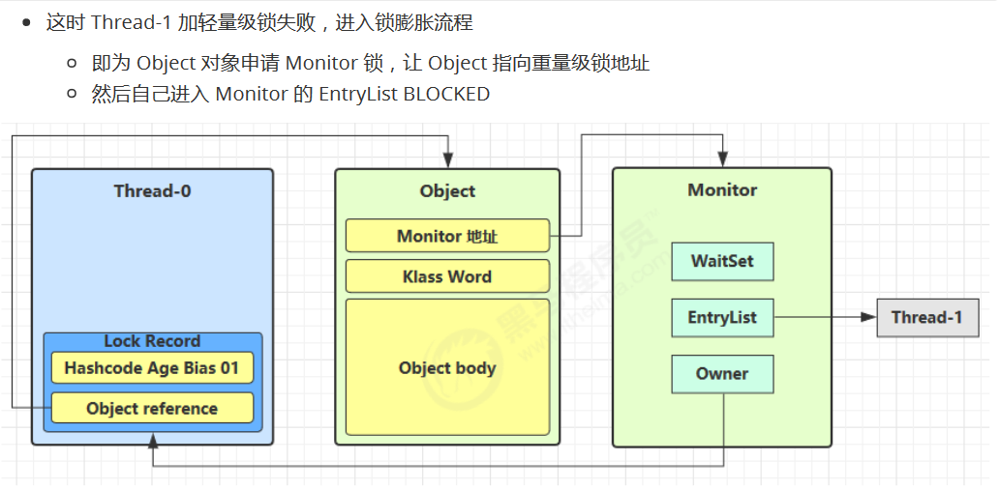

*  当 Thread-0 退出同步块解锁时，使用 cas 将 Mark Word 的值恢复给对象头，失败。这时会进入重量级解锁流程，即按照 Monitor 地址找到 Monitor 对象，设置 Owner 为 null，唤醒 EntryList 中 BLOCKED 线程 


**3. 自旋优化**

重量级锁竞争的时候，还可以使用自旋来进行优化，如果当前线程自旋成功（即这时候持锁线程已经退出了同步块，释放了锁），这时当前线程就可以避免阻塞 


**4.偏向锁**

轻量级锁在没有竞争时（就自己这个线程），每次重入仍然需要执行 CAS 操作。

Java 6 中引入了偏向锁来做进一步优化：只有第一次使用 CAS 将线程 ID 设置到对象的 Mark Word 头，之后发现这个线程 ID 是自己的就表示没有竞争，不用重新 CAS。以后只要不发生竞争，这个对象就归该线程所有 

流程：用 ThreadID 替换 markword -->  检查 ThreadID 是否是自己 


###  wait notify 原理 

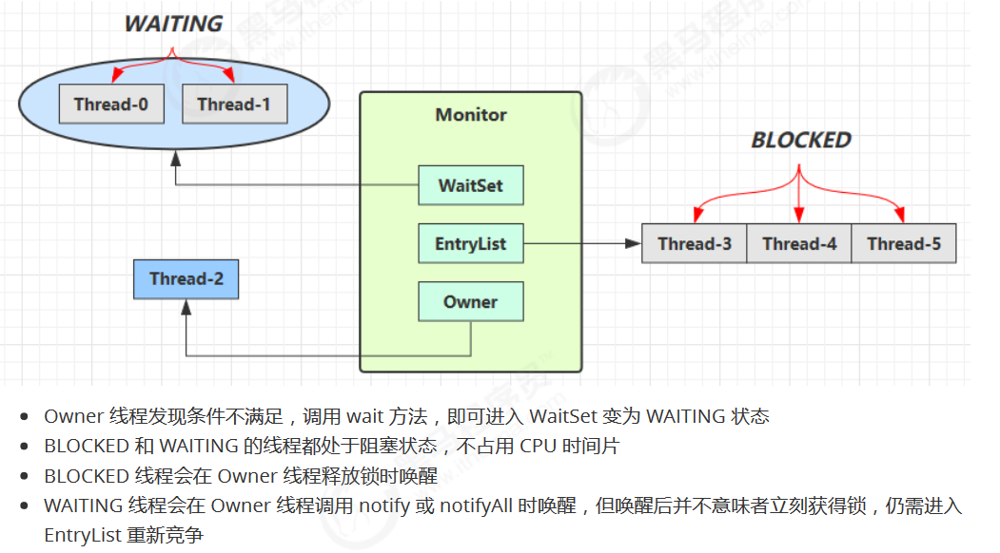


sleep(long n)和wait(long n)的区别 

1) sleep 是 Thread 方法，而 wait 是 Object 的方法 

2) sleep 不需要强制和 synchronized 配合使用，但 wait 需要和 synchronized 一起用 

3) sleep 在睡眠的同时，不会释放对象锁的，但 wait 在等待的时候会释放对象锁 

4) 它们状态 TIMED_WAITING


* notify 只能随机唤醒一个 WaitSet 中的线程，这时如果有其它线程也在等待，那么就可能唤醒不了正确的线程，称之为【虚假唤醒】
* 解决方法，改为 notifyAll 


###  join 原理 

是调用者轮询检查线程 alive 状态 


###  park unpark 原理 

每个线程都有自己的一个 Parker 对象，由三部分组成counter，cond和mutex打个比喻

* 线程就像一个旅人，Parker 就像他随身携带的背包，条件变量就好比背包中的帐篷。_counter 就好比背包中的备用干粮（0 为耗尽，1 为充足）
* 调用 park 就是要看需不需要停下来歇息
  * 如果备用干粮耗尽，那么钻进帐篷歇息
  * 如果备用干粮充足，那么不需停留，继续前进
* 调用 unpark，就好比令干粮充足
  * 如果这时线程还在帐篷，就唤醒让他继续前进
  * 如果这时线程还在运行，那么下次他调用 park 时，仅是消耗掉备用干粮，不需停留继续前进
    * 因为背包空间有限，多次调用 unpark 仅会补充一份备用干粮 

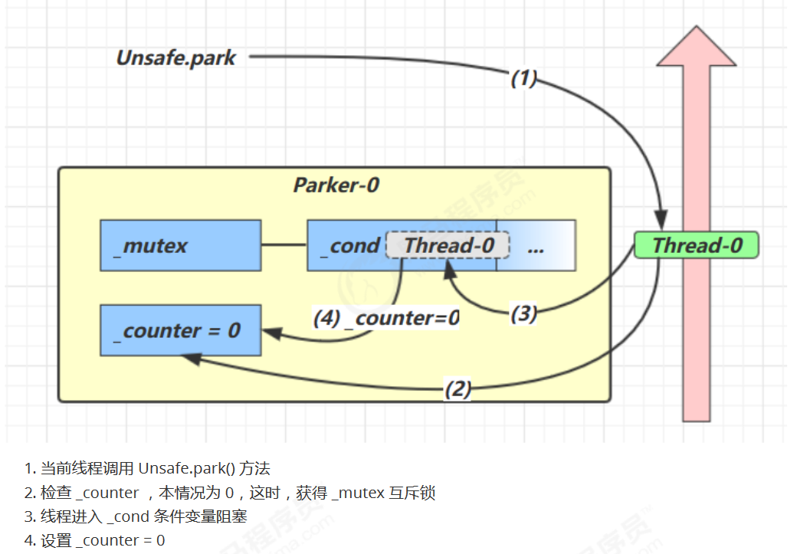

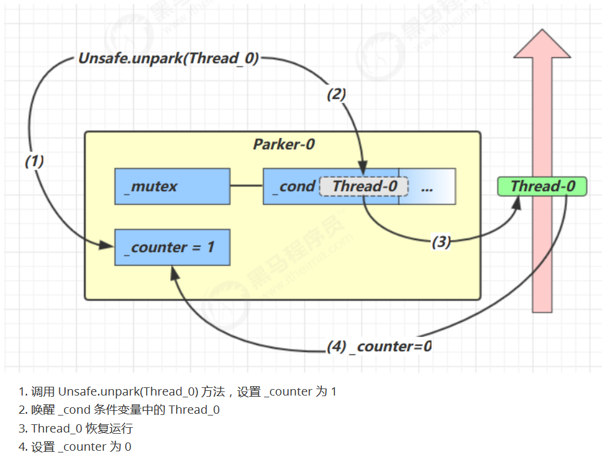

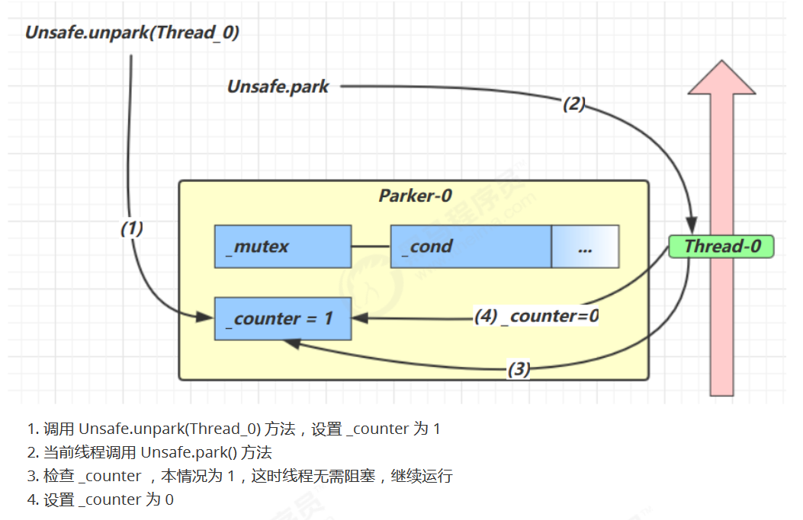


与 Object 的 wait & notify 相比

* wait，notify 和 notifyAll 必须配合 Object Monitor 一起使用，而 park，unpark 不必 
*  park & unpark 是以**线程**为单位来【阻塞】和【唤醒】线程，而 notify 只能随机唤醒一个等待线程，notifyAll 是唤醒所有等待线程，就不那么【精确】
* park & unpark 可以先 unpark，而 wait & notify 不能先 notify 


###  重新理解线程状态转换 

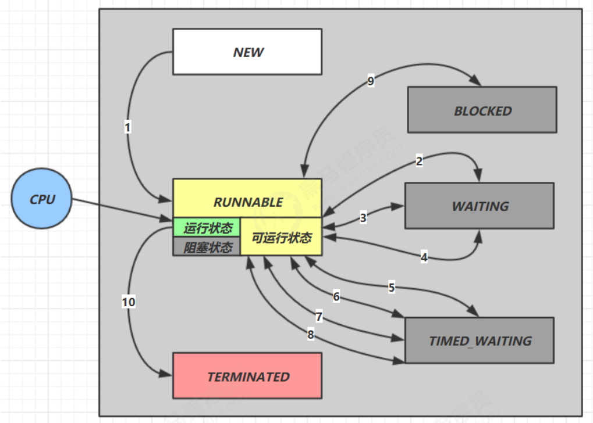

BLOCKER和WAITING的区别

**BLOCKED**

* 受阻塞并等待某个监视器锁的线程处于这种状态。 

**WAITING**

* 无限期地等待另一个线程来执行某一特定操作的线程处于这种状态。 

WAITING处于无限期的等待唤醒，唤醒后会争抢锁，如果争抢不到锁则进入BLOCKER

 

线程调用 interrupt( ) 打断方法后直接进入RUNNABLE状态


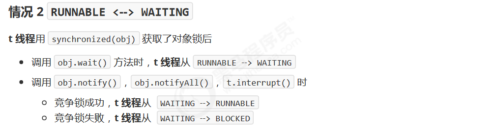

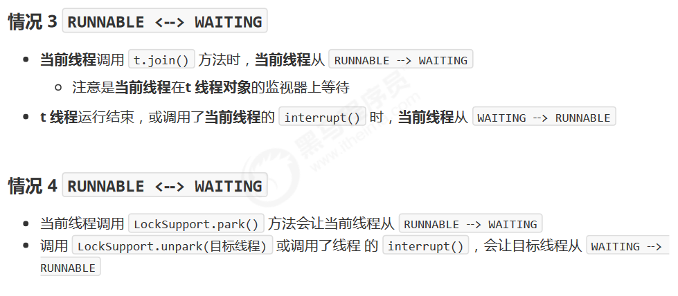


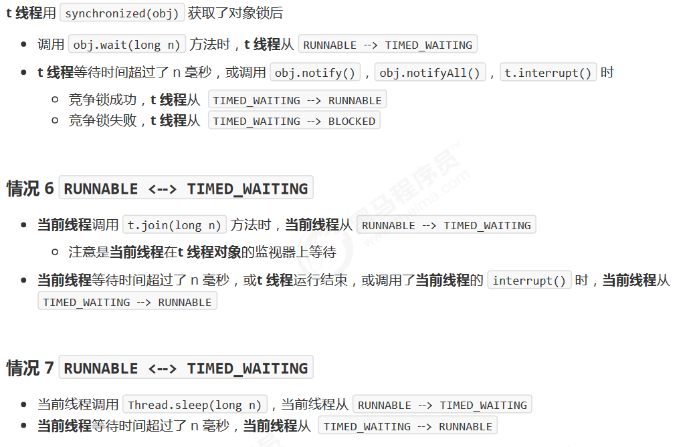

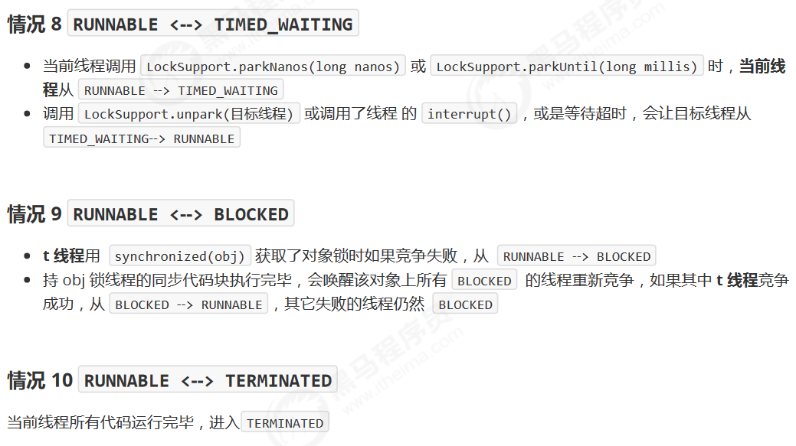


###  多把锁 

 一间大屋子有两个功能：睡觉、学习，互不相干。

现在小南要学习，小女要睡觉，但如果只用一间屋子（一个对象锁）的话，那么并发度很低

解决方法是准备多个房间（多个对象锁)

将锁的粒度细

* 分好处，是可以增强并发度
* 坏处，如果一个线程需要同时获得多把锁，就容易发生死锁 


###  活跃性 

**死锁** 

一个线程需要同时获取多把锁，这时就容易发生死锁

t1 线程获得A对象锁，接下来想获取B对象的锁

t2 线程获得B对象锁，接下来想获取A对象的锁 


**定位死锁 **

检测死锁可以使用 jconsole工具，或者使用 jps 定位进程 id，再用 jstack 定位死锁 


 **活锁** 

 活锁出现在两个线程互相改变对方的结束条件，最后谁也无法结束 


 **饥饿** 

很多教程中把饥饿定义为，一个线程由于优先级太低，始终得不到 CPU 调度执行，也不能够结束，饥饿的情况不易演示，讲读写锁时会涉及饥饿问题 


###  ReentrantLock 

相对于 synchronized 它具备如下特点

* 可中断
* 可以设置超时时间
* 可以设置为公平锁
* 支持多个条件变量 

 与 synchronized 一样，都支持可重入 

```java
// 获取锁
reentrantLock.lock();
try {
    // 临界区
} finally {
    // 释放锁
    reentrantLock.unlock();
}
```


**可重入**

可重入是指同一个线程如果首次获得了这把锁，那么因为它是这把锁的拥有者，因此有权利再次获取这把锁如果是不可重入锁，那么第二次获得锁时，自己也会被锁挡住 

**可打断 **

**锁超时 **

假设tryLock等待1s后仍获取不到锁，则放弃之前的操作，将获取的锁释放给其他线程。重新循环获取锁

**公平锁 **

**条件变量**

synchronized 中也有条件变量，就是我们讲原理时那个 waitSet 休息室，当条件不满足时进入 waitSet 等待

ReentrantLock 的条件变量比 synchronized 强大之处在于，它支持多个条件变量，这就好比

* synchronized 是那些不满足条件的线程都在一间休息室等消息
* 而 ReentrantLock 支持多间休息室，有专门等烟的休息室、专门等早餐的休息室、唤醒时也是按休息室来唤醒 


### 总结

本章我们需要重点掌握的是

* 分析多线程访问共享资源时，哪些代码片段属于临界区使用 
* synchronized 互斥解决临界区的线程安全问题
  * 掌握 synchronized 锁对象语法
  * 掌握 synchronzied 加载成员方法和静态方法语法
  * 掌握 wait/notify 同步方法
* 使用 lock 互斥解决临界区的线程安全问题
  * 掌握 lock 的使用细节：可打断、锁超时、公平锁、条件变量
* 学会分析变量的线程安全性、掌握常见线程安全类的使用
* 了解线程活跃性问题：死锁、活锁、饥饿
* 应用方面
  * 互斥：使用 synchronized 或 Lock 达到共享资源互斥效果
  * 同步：使用 wait/notify 或 Lock 的条件变量来达到线程间通信效果
* 原理方面
  * monitor、synchronized 、wait/notify 原理
  * synchronized 进阶原理
  * park & unpark 原理
* 模式方面
  * 同步模式之保护性暂停
  * 异步模式之生产者消费者
  * 同步模式之顺序控制 


## 5、共享模型之内存 