# 并发编程个人总结

## 一、进程与线程

### 1、进程

* 程序由指令和数据组成，但这些指令要运行，数据要读写，就必须将指令加载至 CPU，数据加载至内存。在指令运行过程中还需要用到磁盘、网络等设备。进程就是用来加载指令、管理内存、管理 IO 的 
*  当一个程序被运行，从磁盘加载这个程序的代码至内存，这时就开启了一个进程 
*  进程就可以视为程序的一个实例。大部分程序可以同时运行多个实例进程（例如记事本、画图、浏览器等），也有的程序只能启动一个实例进程（例如网易云音乐、360 安全卫士等） 

### 2、线程

-  一个进程之内可以分为一到多个线程 
-  一个线程就是一个指令流，将指令流中的一条条指令以一定的顺序交给 CPU 执行 
-  Java 中，线程作为最小调度单位，进程作为资源分配的最小单位。在 windows 中进程是不活动的，只是作为线程的容器 

### 3、二者对比

* 进程基本上相互独立的，而线程存在于进程内，是进程的一个子集
* 进程拥有共享的资源，如 **内存空间** 等，供其内部的线程共享
* 进程间通信较为复杂：
  * 同一台计算机的进程通信称为 IPC（Inter-process communication）
  * 不同计算机之间的进程通信，需要通过网络，并遵守共同的协议，例如 HTTP
* 线程通信相对简单，因为它们共享进程内的内存，一个例子是多个线程可以访问同一个共享变量
* 线程更轻量，线程上下文切换成本一般上要比进程上下文切换低 


## 二、并发与并行

 ### 1、并发

并发（concurrent）是同一时间应对（dealing with）多件事情的能力。 

单核 cpu 下，线程实际还是串行执行的。操作系统中有一个组件叫做任务调度器，将 cpu 的时间片（windows下时间片最小约为 15 毫秒）分给不同的程序使用，只是由于 cpu 在线程间（时间片很短）的切换非常快，人类感觉是同时运行的。总结为一句话就是：**微观串行，宏观并行 **

 一般会将这种线程 **轮流使用CPU** 的做法称为并发， concurrent 

### 2、并行

并行（parallel）是同一时间动手做（doing）多件事情的能力 

### 3、同步与异步

需要等待结果返回，才能继续运行就是同步 

不需要等待结果返回，就能继续运行就是异步 


## 三、Java线程

### 1、创建与运行线程

**直接使用Thread**：创建线程对象 、启动线程

**使用Runnable配合Thread**：把【线程】和【任务】（要执行的代码）分开、 Thread 代表线程、 Runnable 可运行的任务（线程要执行的代码） 

**FutureTask配合Thread**： FutureTask 能够接收 Callable 类型的参数，用来处理有返回结果的情况 


### 2、查看进程线程的方法

window： tasklist（查看进程）、taskkill（杀死进程）

linux：ps -fe（查看所有进程）、kill（杀死进程）  

java：jps（ 查看所有 Java 进程 ）、jstack（查看某个Java进程PID的所有线程状态）、jconsole（以图形界面查看某个Java进程中线程的运行情况）


### 3、线程运行原理

**栈与栈帧**

一个线程拥有一个私有虚拟机栈；一个虚拟机栈可以拥有多个栈帧；一个栈帧对应一个方法的调用；线程可以调用多个方法，每调用一个方法，就将方法信息以栈帧方式压栈。

**线程上线文切**

因为以下一些原因导致 cpu 不再执行当前的线程，转而执行另一个线程的代码 

*  线程的 cpu 时间片用完 
* 垃圾回收
* 有更高优先级的线程需要运行
* 线程自己调用了sleep、yield、wait、join、prak、synchronized、lock等方法

 当 Context Switch 发生时，需要由操作系统保存当前线程的状态，并恢复另一个线程的状态，Java 中对应的概念就是程序计数器（Program Counter Register），它的作用是记住下一条 jvm 指令的执行地址，是线程私有的 

* 状态包括程序计数器、虚拟机栈中每个栈帧的信息，如局部变量、操作数栈、返回地址等 
* Context Switch 频繁发生会影响性能 


### 4、start 与 run 

start 方法只是让线程进入就绪，里面代码不一定立刻运行（CPU 的时间片还没分给它）。每个线程对象的start方法只能调用一次，如果调用了多次会出现IllegalThreadStateException 

### 5、sleep 与 yield 

sleep

*  调用 sleep 会让当前线程从Running进入Timed Waiting状态（阻塞 
*  其它线程可以使用  interrupt 方法打断正在睡眠的线程，这时 sleep 方法会抛出InterruptedException
*  睡眠结束后的线程未必会立刻得到执行 
*  建议用 TimeUnit 的 sleep 代替 Thread 的 sleep 来获得更好的可读性 

yield

*  调用 yield 会让当前线程从Running进入Runnable就绪状态，然后调度执行其它线程 
*  具体的实现依赖于操作系统的任务调度器 

### 6、join

 等待线程运行结束 

### 7、interrupt

打断 sleep，wait，join 的线程， 这几个方法都会让线程进入阻塞状态 

*  打断 sleep 的线程, 会清空打断状态 
*  打断正常运行的线程, 不会清空打断状态 
*  打断 park 线程, 不会清空打断状态 

### 8、不推荐的方法

这些方法已过时，容易破坏同步代码块，造成线程死锁 ：

stop() 、suspend()、resume()

stop()：强行将线程中所有状态停止，容易导致死锁

suspend()：调用该方法后将其线程挂起，如果此时在该线程中添加一把锁，那么并不会释放锁，此刻就进行死锁状态

resume()：将上述的线程唤醒，但毕业suspend()执行完后才可以执行此方法，否则会死锁

### 9、主线程与守护线程

默认情况下，Java 进程需要等待所有线程都运行结束，才会结束。

有一种特殊的线程叫做守护线程，只要其它非守护线程运行结束了，即使守护线程的代码没有执行完，也会强制结束 

>*  垃圾回收器线程就是一种守护线程 
>
>*  omcat 中的 Acceptor 和 Poller 线程都是守护线程，所以 Tomcat 接收到 shutdown 命令后，不会等待它们处理完当前请求 

### 10、五种状态

初始状态、可运行状态、运行状态、阻塞状态、终止状态

*  【初始状态】仅是在语言层面创建了线程对象，还未与操作系统线程关联 
*  【可运行状态】（就绪状态）指该线程已经被创建（与操作系统线程关联），可以由 CPU 调度执行 
*  【运行状态】指获取了 CPU 时间片运行中的状态 
  * 当 CPU 时间片用完，会从【运行状态】转换至【可运行状态】，会导致线程的上下文切换 
*  【阻塞状态】 
  *  如果调用了阻塞 API，如 BIO 读写文件，这时该线程实际不会用到 CPU，会导致线程上下文切换，进入【阻塞状态】 
  *  等 BIO 操作完毕，会由操作系统唤醒阻塞的线程，转换至【可运行状态】 
  *  与【可运行状态】的区别是，对【阻塞状态】的线程来说只要它们一直不唤醒，调度器就一直不会考虑调度它们 

*  【终止状态】表示线程已经执行完毕，生命周期已经结束，不会再转换为其它状态 

### 11、六种状态

### 12、wait 与 notifyAll

这两个方法需要由**同一对象锁的持有者线程**调用，也就是写在同步课中，否则会抛出异常

wait方法导致当前线程等待，加入该对象的等待集合中，并且放弃当前持有的对象锁

notify/notifyAll方法唤醒一个或所有正在等待这个对象锁的线程

注意：虽然wait方法会自动解锁，但是对顺序有要求，如果在notify被调用之后，才开始wait方法的调用，那么线程会永远处于WAITING状态

### 13、park 与 unpark

线程调用park则等待"许可"，unpark方法为指定线程提供" 许可（premit）"

注意：不要求park和unpark方法的调用顺序

多次调用unpark之后，再调用park，线程会直接运行

但不会叠加，也就是说，连续多次调用park方法，第一次会拿到 "许可"直接运行，后续调用会进行等待

**unpark需要指定线程，也就是指定调用park的线程**

缺点：如果在synchronized（this）中调用park方法，那么在另外一个synchronized（this）没办法调用unpark（this）方法，此时就形成了死锁状态

```java
Thread t1 = new Thread(){
	synchronized(this){
  	  	LockSupport.park();
	}
}
```

```java
synchronized(this){
    LockSupport.unpark();
}
```

### 14、伪唤醒

官方建议在循环中检查等待条件，原因是处于等待状态的线程可能会受到错误警报和伪唤醒，如果不在循环中检查等待条件，程序就会在没有满足条件的情况下退出

```java
synchronized(obj){
    while(<条件判断>)
        obj.wait();
    ..//执行后续操作
}
```


## 四、共享模型值管程

### 1、临界区

*  一个程序运行多个线程本身是没有问题的 
*  问题出在多个线程访问**共享资源** 
  *  多个线程读共享资源其实也没有问题 
  *  在多个线程对共享资源读写操作时发生**指令交错**，就会出现问题 

*  一段代码块内如果存在对**共享资源**的多线程读写操作，称这段代码块为**临界区** 


###  2、竞态条件 

多个线程在临界区内执行，由于代码的执行序列不同而导致结果无法预测，称之为发生了竞态条件 


###  3、synchronized 解决方案 

应用之互斥 ：本次课使用阻塞式的解决方案：synchronized，来解决上述问题，即俗称的【对象锁】，它采用互斥的方式让同一时刻至多只有一个线程能持有【对象锁】，其它线程再想获取这个【对象锁】时就会阻塞住。这样就能保证拥有锁的线程可以安全的执行临界区内的代码，不用担心线程上下文切换

>  虽然 java 中互斥和同步都可以采用 synchronized 关键字来完成，但它们还是有区别的： 
>
> *  互斥是保证临界区的竞态条件发生，同一时刻只能有一个线程执行临界区代码 
> *  同步是由于线程执行的先后、顺序不同、需要一个线程等待其它线程运行到某个点 

```java
synchronized(对象) // 线程1，线程2(blocked)
{
    临界区
}
```

 不加 synchronized 的方法 : 不加 synchronzied 的方法就好比不遵守规则的人，不去老实排队（好比翻窗户进去的） 


###  4、变量的线程安全分析 

**成员变量和静态变量是否线程安全?**

*  如果它们没有共享，则线程安全 
*  如果它们被共享了，根据它们的状态是否能够改变，又分两种情况 
  *  如果只有读操作，则线程安全 
  *  如果有读写操作，则这段代码是临界区，需要考虑线程安全 

**局部变量是否线程安全?**

*  局部变量是线程安全的 
*  但局部变量引用的对象则未必 
  *  如果该对象没有逃离方法的作用访问，它是线程安全的 
  *  如果该对象逃离方法的作用范围，需要考虑线程安全 


###  5、常见线程安全类

* String
* Integer
* StringBuffer
* Random
* Vector
* Hashtable
* java.util.concurrent 包下的类 

这里说它们是线程安全的是指，多个线程调用它们同一个实例的某个方法时，是线程安全的。 

> 它们的每个方法是原子的 
>
> 但注意它们多个方法的组合不是原子的 


###  6、Monitor 概念 

**Java 对象头** 

普通对象 

```java
|--------------------------------------------------------------|
|                      ObjectHeader (64bits)                   |
|------------------------------------|-------------------------|
|         MarkWord (32bits)          |    KlassWord (32bits)   |
|------------------------------------|------------------------ |
```

 数组对象 


 64 位虚拟机 Mark Word 


Monitor 被翻译为**监视器或管程**

每个 Java 对象都可以关联一个 Monitor 对象，如果使用 synchronized 给对象上锁（重量级）之后，该对象头的Mark Word 中就被设置指向 Monitor 对象的指针 


*  刚开始 Monitor 中 Owner 为 null
* 当 Thread-2 执行 synchronized(obj) 就会将 Monitor 的所有者 Owner 置为 Thread-2，Monitor中只能有一个 Owner
* 在 Thread-2 上锁的过程中，如果 Thread-3，Thread-4，Thread-5 也来执行 synchronized(obj)，就会进入EntryList BLOCKED
* Thread-2 执行完同步代码块的内容，然后唤醒 EntryList 中等待的线程来竞争锁，竞争的时是非公平的
* 图中 WaitSet 中的 Thread-0，Thread-1 是之前获得过锁，但条件不满足进入 WAITING 状态的线程，后面讲wait-notify 时会分析 


###  7、synchronized 原理 

**1. 轻量级锁 **

轻量级锁的使用场景：如果一个对象虽然有多线程要加锁，但加锁的时间是错开的（也就是没有竞争），那么可以使用轻量级锁来优化。轻量级锁对使用者是透明的，即语法仍然是synchronized 

*  创建锁记录（Lock Record）对象，每个线程都的栈帧都会包含一个锁记录的结构，内部可以存储锁定对象的Mark Word 


*  让锁记录中 Object reference 指向锁对象，并尝试用 cas 替换 Object 的 Mark Word，将 Mark Word 的值存入锁记录 


*  如果 cas 替换成功，对象头中存储了锁记录地址和状态 00，表示由该线程给对象加锁，这时图示如下 


*  如果 cas 失败，有两种情况 
  *  如果是其它线程已经持有了该 Object 的轻量级锁，这时表明有竞争，进入锁膨胀过程 
  *  如果是自己执行了 synchronized 锁重入，那么再添加一条 Lock Record 作为重入的计数 


*  当退出 synchronized 代码块（解锁时）如果有取值为 null 的锁记录，表示有重入，这时重置锁记录，表示重入计数减一 


*  当退出 synchronized 代码块（解锁时）锁记录的值不为 null，这时使用 cas 将 Mark Word 的值恢复给对象头 
  *  成功，则解锁成功 
  *  失败，说明轻量级锁进行了锁膨胀或已经升级为重量级锁，进入重量级锁解锁流程 


**2. 锁膨胀 **

如果在尝试加轻量级锁的过程中，CAS 操作无法成功，这时一种情况就是有其它线程为此对象加上了轻量级锁（有竞争），这时需要进行锁膨胀，将轻量级锁变为重量级锁 


*  当 Thread-0 退出同步块解锁时，使用 cas 将 Mark Word 的值恢复给对象头，失败。这时会进入重量级解锁流程，即按照 Monitor 地址找到 Monitor 对象，设置 Owner 为 null，唤醒 EntryList 中 BLOCKED 线程 


**3. 自旋优化**

重量级锁竞争的时候，还可以使用自旋来进行优化，如果当前线程自旋成功（即这时候持锁线程已经退出了同步块，释放了锁），这时当前线程就可以避免阻塞 


**4.偏向锁**

轻量级锁在没有竞争时（就自己这个线程），每次重入仍然需要执行 CAS 操作。

Java 6 中引入了偏向锁来做进一步优化：只有第一次使用 CAS 将线程 ID 设置到对象的 Mark Word 头，之后发现这个线程 ID 是自己的就表示没有竞争，不用重新 CAS。以后只要不发生竞争，这个对象就归该线程所有 

流程：用 ThreadID 替换 markword -->  检查 ThreadID 是否是自己 


###  8、wait notify 原理 


sleep(long n)和wait(long n)的区别 

1) sleep 是 Thread 方法，而 wait 是 Object 的方法 

2) sleep 不需要强制和 synchronized 配合使用，但 wait 需要和 synchronized 一起用 

3) sleep 在睡眠的同时，不会释放对象锁的，但 wait 在等待的时候会释放对象锁 

4) 它们状态 TIMED_WAITING


* notify 只能随机唤醒一个 WaitSet 中的线程，这时如果有其它线程也在等待，那么就可能唤醒不了正确的线程，称之为【虚假唤醒】
* 解决方法，改为 notifyAll 


###  9、join 原理 

是调用者轮询检查线程 alive 状态 


###  10、park unpark 原理 

每个线程都有自己的一个 Parker 对象，由三部分组成counter，cond和mutex打个比喻

* 线程就像一个旅人，Parker 就像他随身携带的背包，条件变量就好比背包中的帐篷。_counter 就好比背包中的备用干粮（0 为耗尽，1 为充足）
* 调用 park 就是要看需不需要停下来歇息
  * 如果备用干粮耗尽，那么钻进帐篷歇息
  * 如果备用干粮充足，那么不需停留，继续前进
* 调用 unpark，就好比令干粮充足
  * 如果这时线程还在帐篷，就唤醒让他继续前进
  * 如果这时线程还在运行，那么下次他调用 park 时，仅是消耗掉备用干粮，不需停留继续前进
    * 因为背包空间有限，多次调用 unpark 仅会补充一份备用干粮 


与 Object 的 wait & notify 相比

* wait，notify 和 notifyAll 必须配合 Object Monitor 一起使用，而 park，unpark 不必 
*  park & unpark 是以**线程**为单位来【阻塞】和【唤醒】线程，而 notify 只能随机唤醒一个等待线程，notifyAll 是唤醒所有等待线程，就不那么【精确】
* park & unpark 可以先 unpark，而 wait & notify 不能先 notify 


###  11、重新理解线程状态转换 


BLOCKER和WAITING的区别

**BLOCKED**

* 受阻塞并等待某个监视器锁的线程处于这种状态。 

**WAITING**

* 无限期地等待另一个线程来执行某一特定操作的线程处于这种状态。 

WAITING处于无限期的等待唤醒，唤醒后会争抢锁，如果争抢不到锁则进入BLOCKER

 

线程调用 interrupt( ) 打断方法后直接进入RUNNABLE状态


###  12、多把锁 

 一间大屋子有两个功能：睡觉、学习，互不相干。

现在小南要学习，小女要睡觉，但如果只用一间屋子（一个对象锁）的话，那么并发度很低

解决方法是准备多个房间（多个对象锁)

将锁的粒度细

* 分好处，是可以增强并发度
* 坏处，如果一个线程需要同时获得多把锁，就容易发生死锁 


###  13、活跃性 

**死锁** 

一个线程需要同时获取多把锁，这时就容易发生死锁

t1 线程获得A对象锁，接下来想获取B对象的锁

t2 线程获得B对象锁，接下来想获取A对象的锁 


**定位死锁 **

检测死锁可以使用 jconsole工具，或者使用 jps 定位进程 id，再用 jstack 定位死锁 


 **活锁** 

 活锁出现在两个线程互相改变对方的结束条件，最后谁也无法结束 


 **饥饿** 

很多教程中把饥饿定义为，一个线程由于优先级太低，始终得不到 CPU 调度执行，也不能够结束，饥饿的情况不易演示，讲读写锁时会涉及饥饿问题 


###  14、ReentrantLock 

相对于 synchronized 它具备如下特点

* 可中断
* 可以设置超时时间
* 可以设置为公平锁
* 支持多个条件变量 

 与 synchronized 一样，都支持可重入 

```java
// 获取锁
reentrantLock.lock();
try {
    // 临界区
} finally {
    // 释放锁
    reentrantLock.unlock();
}
```


**可重入**

可重入是指同一个线程如果首次获得了这把锁，那么因为它是这把锁的拥有者，因此有权利再次获取这把锁如果是不可重入锁，那么第二次获得锁时，自己也会被锁挡住 

**可打断 **

**锁超时 **

假设tryLock等待1s后仍获取不到锁，则放弃之前的操作，将获取的锁释放给其他线程。重新循环获取锁

**公平锁 **

**条件变量**

synchronized 中也有条件变量，就是我们讲原理时那个 waitSet 休息室，当条件不满足时进入 waitSet 等待

ReentrantLock 的条件变量比 synchronized 强大之处在于，它支持多个条件变量，这就好比

* synchronized 是那些不满足条件的线程都在一间休息室等消息
* 而 ReentrantLock 支持多间休息室，有专门等烟的休息室、专门等早餐的休息室、唤醒时也是按休息室来唤醒 


### 15、总结

本章我们需要重点掌握的是

* 分析多线程访问共享资源时，哪些代码片段属于临界区使用 
* synchronized 互斥解决临界区的线程安全问题
  * 掌握 synchronized 锁对象语法
  * 掌握 synchronzied 加载成员方法和静态方法语法
  * 掌握 wait/notify 同步方法
* 使用 lock 互斥解决临界区的线程安全问题
  * 掌握 lock 的使用细节：可打断、锁超时、公平锁、条件变量
* 学会分析变量的线程安全性、掌握常见线程安全类的使用
* 了解线程活跃性问题：死锁、活锁、饥饿
* 应用方面
  * 互斥：使用 synchronized 或 Lock 达到共享资源互斥效果
  * 同步：使用 wait/notify 或 Lock 的条件变量来达到线程间通信效果
* 原理方面
  * monitor、synchronized 、wait/notify 原理
  * synchronized 进阶原理
  * park & unpark 原理
* 模式方面
  * 同步模式之保护性暂停
  * 异步模式之生产者消费者
  * 同步模式之顺序控制 


## 5、共享模型之内存 

### 1、Java内存模型

JMM 即 Java Memory Model，它定义了主存、工作内存抽象概念，底层对应着 CPU 寄存器、缓存、硬件内存、CPU 指令优化等 

 JMM 体现在以下几个方面

* 原子性 - 保证指令不会受到线程上下文切换的影响
* 可见性 - 保证指令不会受 cpu 缓存的影响
* 有序性 - 保证指令不会受 cpu 指令并行优化的影响 

### 2、可见性

因为 t 线程要频繁从主内存中读取 run 的值，JIT 编译器会将 run 的值缓存至自己工作内存中的高速缓存中，减少对主存中 run 的访问，提高效率 

1 秒之后，main 线程修改了 run 的值，并同步至主存，而 t 是从自己工作内存中的高速缓存中读取这个变量的值，结果永远是旧值 

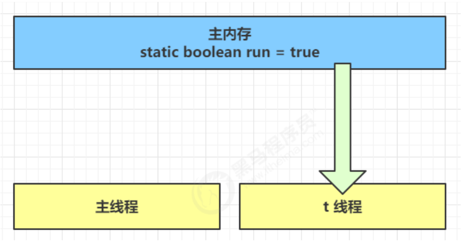

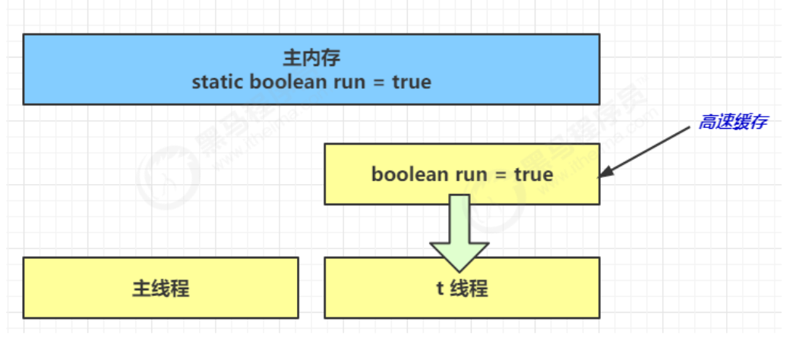

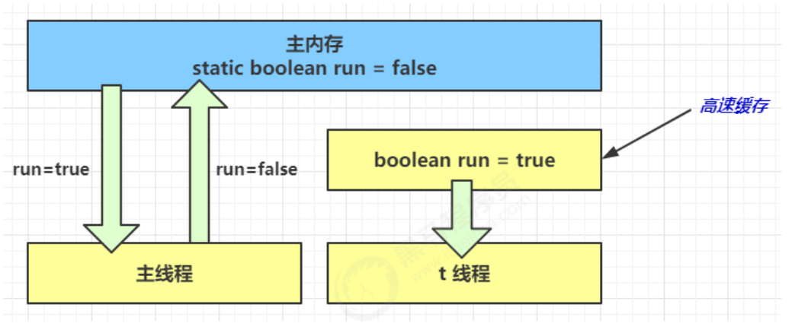

解决方法

**volatile（易变关键字）**

它可以用来修饰成员变量和静态成员变量，他可以避免线程从自己的工作缓存中查找变量的值，必须到主存中获取它的值，线程操作 volatile 变量都是直接操作主存 


**可见性 vs 原子性 **

前面例子体现的实际就是可见性，它保证的是在多个线程之间，一个线程对 volatile 变量的修改对另一个线程可见，不能保证原子性，仅用在一个写线程，多个读线程的情况 

比较一下之前我们将线程安全时举的例子：两个线程一个 i++ 一个 i-- ，只能保证看到最新值，不能解决指令交错 

>注意 synchronized 语句块既可以保证代码块的原子性，也同时保证代码块内变量的可见性。但缺点是synchronized 是属于重量级操作，性能相对更低 


**CPU之缓存结构原理**

**CPU结构**

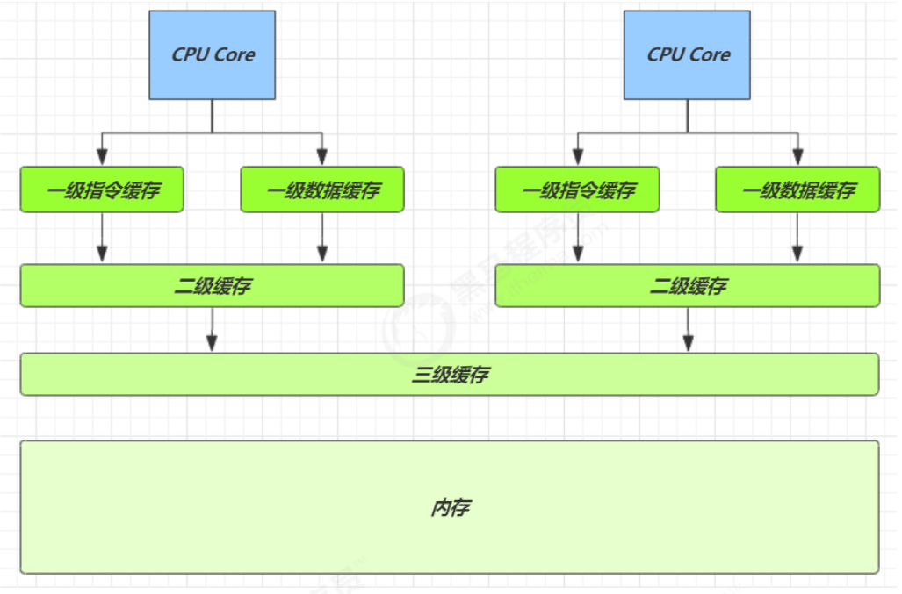

**CPU缓存读**

* 读取数据流程如下根据低位，计算在缓存中的索引
* 判断是否有效
  * 0 去内存读取新数据更新缓存行
  * 1 再对比高位组标记是否一致 
    *  一致，根据偏移量返回缓存数据
    * 不一致，去内存读取新数据更新缓存行 

**CPU缓存一致性**

 MESI 协议

1. E、S、M 状态的缓存行都可以满足 CPU 的读请求
2. E 状态的缓存行，有写请求，会将状态改为 M，这时并不触发向主存的写
3. E 状态的缓存行，必须监听该缓存行的读操作，如果有，要变为 S 状态 

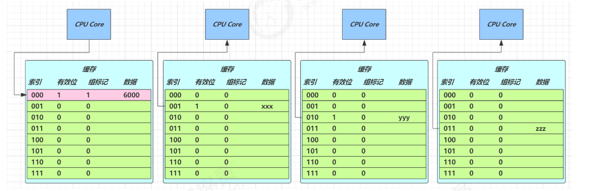

4. M 状态的缓存行，必须监听该缓存行的读操作，如果有，先将其它缓存（S 状态）中该缓存行变成 I 状态（即6. 的流程），写入主存，自己变为 S 状态
5. S 状态的缓存行，有写请求，走 4. 的流程
6. S 状态的缓存行，必须监听该缓存行的失效操作，如果有，自己变为 I 状态
7. I 状态的缓存行，有读请求，必须从主存读 

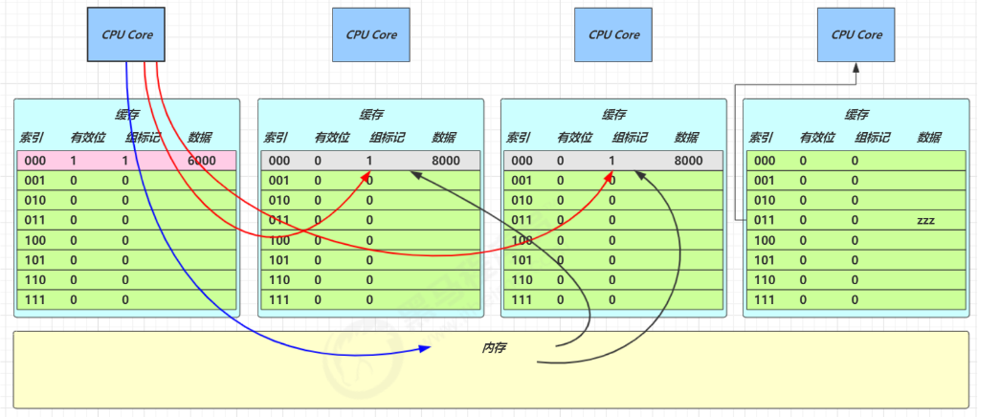

**内存屏障 **

Memory Barrier（Memory Fence） 

* 可见性
  * 写屏障（sfence）保证在该屏障之前的，对共享变量的改动，都同步到主存当中
  * 而读屏障（lfence）保证在该屏障之后，对共享变量的读取，加载的是主存中最新数据
* 有序性
  * 写屏障会确保指令重排序时，不会将写屏障之前的代码排在写屏障之后
  * 读屏障会确保指令重排序时，不会将读屏障之后的代码排在读屏障之前 

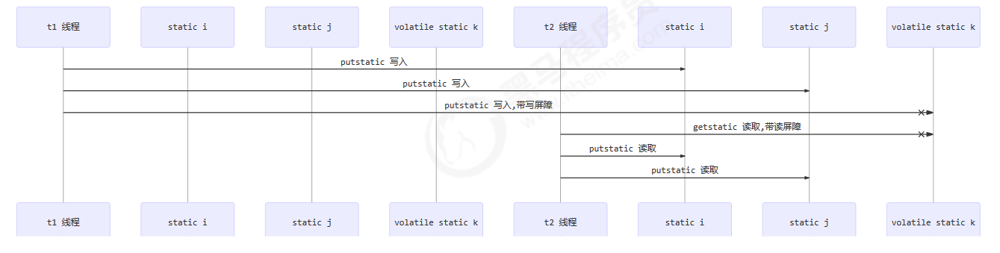


### 3、有序性

 JVM 会在不影响正确性的前提下，可以调整语句的执行顺序，这种特性称之为『指令重排』，多线程下『指令重排』会影响正确性。 

**volatile**

volatile 的底层实现原理是内存屏障，Memory Barrier（Memory Fence）对 volatile 变量的写指令后会加入写屏障对 volatile 变量的读指令前会加入读屏障 

*  如何保证可见性

写屏障（sfence）保证在**该屏障之前**的，对共享变量的改动，都同步到主存当中 

```java
public void actor2(I_Resultr) {
    num=2;
    ready=true; // ready是volatile 赋值带写屏障
    // 写屏障
}
```

 而读屏障（lfence）保证在该**屏障之后**，对共享变量的读取，加载的是主存中最新数据 

```java
public void actor1(I_Resultr) {
    // 读屏障
    // ready 是 volatile 读取值带读屏障
    if(ready) {
        r.r1=num+num;    
    } else {
        r.r1=1;    
    }
}
```

*  如何保证有序性 

写屏障会确保指令重排序时，不会将写屏障之前的代码排在写屏障之后 

读屏障会确保指令重排序时，不会将读屏障之后的代码排在读屏障之前 


还是那句话，不能解决指令交错：

* 写屏障仅仅是保证之后的读能够读到最新的结果，但不能保证读跑到它前面去
* 而有序性的保证也只是保证了本线程内相关代码不被重排序 


## 六、共享模型之无锁

### 1、CAS 与 volatile 

**volatile** 

获取共享变量时，为了保证该变量的可见性，需要使用 volatile 修饰。

它可以用来修饰成员变量和静态成员变量，他可以避免线程从自己的工作缓存中查找变量的值，必须到主存中获取它的值，线程操作 volatile 变量都是直接操作主存。即一个线程对 volatile 变量的修改，对另一个线程可见 

CAS 必须借助 volatile 才能读取到共享变量的最新值来实现【比较并交换】的效果 


**为什么无锁效率高** 

* 无锁情况下，即使重试失败，线程始终在高速运行，没有停歇，而 synchronized 会让线程在没有获得锁的时候，发生上下文切换，进入阻塞。打个比喻
* 线程就好像高速跑道上的赛车，高速运行时，速度超快，一旦发生上下文切换，就好比赛车要减速、熄火，等被唤醒又得重新打火、启动、加速... 恢复到高速运行，代价比较大
* 但无锁情况下，因为线程要保持运行，需要额外 CPU 的支持，CPU 在这里就好比高速跑道，没有额外的跑道，线程想高速运行也无从谈起，虽然不会进入阻塞，但由于没有分到时间片，仍然会进入可运行状态，还是会导致上下文切换 


**CAS 的特点**

* 结合 CAS 和 volatile 可以实现无锁并发，适用于线程数少、多核 CPU 的场景下。CAS 是基于乐观锁的思想：最乐观的估计，不怕别的线程来修改共享变量，就算改了也没关系，我吃亏点再重试呗。
* synchronized 是基于悲观锁的思想：最悲观的估计，得防着其它线程来修改共享变量，我上了锁你们都别想改，我改完了解开锁，你们才有机会。
* CAS 体现的是无锁并发、无阻塞并发，请仔细体会这两句话的意思
  * 因为没有使用 synchronized，所以线程不会陷入阻塞，这是效率提升的因素之一
  * 但如果竞争激烈，可以想到重试必然频繁发生，反而效率会受影响 


**ABA 问题及解决 **

主线程仅能判断出共享变量的值与最初值 A 是否相同，不能感知到这种从 A 改为 B 又改回 A 的情况，如果主线程希望：

只要有其它线程【动过了】共享变量，那么自己的 cas 就算失败，这时，仅比较值是不够的，需要再加一个版本号**AtomicStampedReference **

**AtomicStampedReference** 可以给原子引用加上版本号，追踪原子引用整个的变化过程，如：A -> B -> A ->C，通过AtomicStampedReference，我们可以知道，引用变量中途被更改了几次。

但是有时候，并不关心引用变量更改了几次，只是单纯的关心**是否更改过**，所以就有了AtomicMarkableReference 


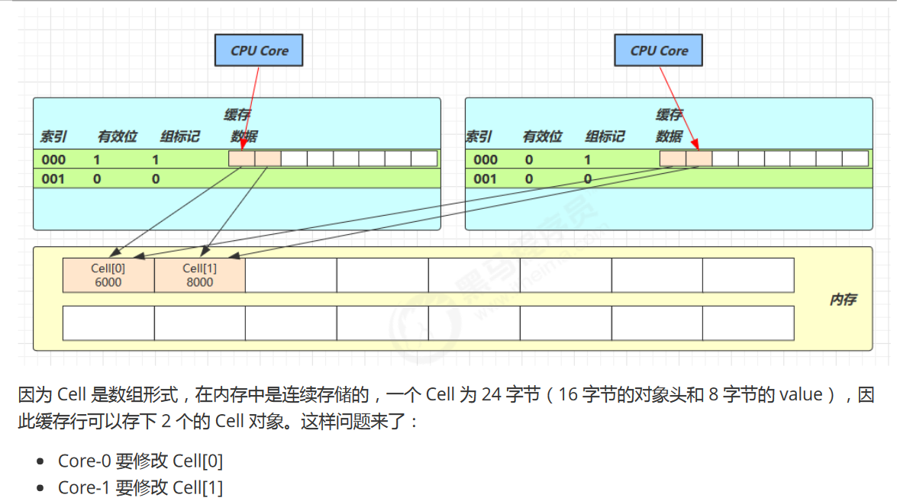

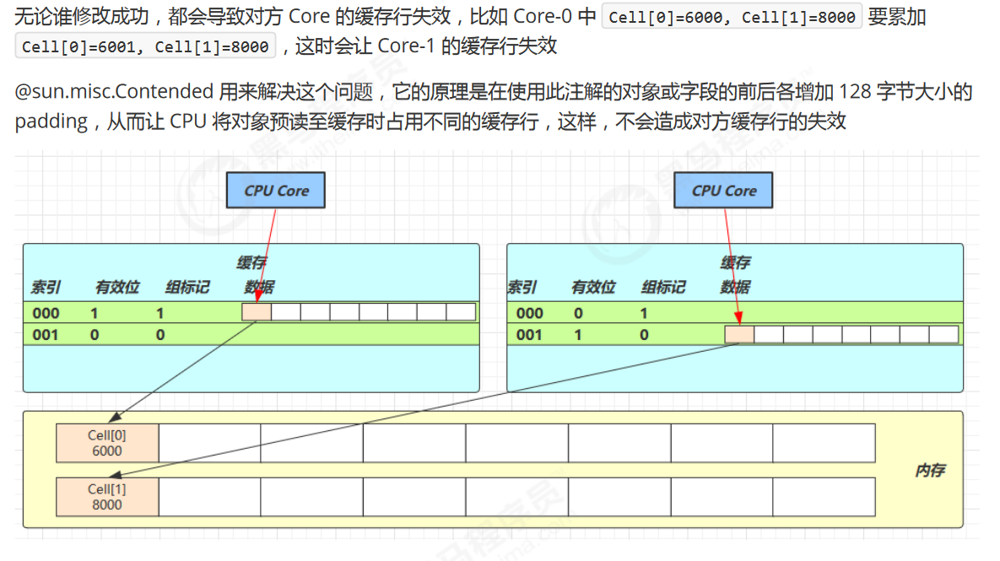

### 2、Unsafe 

Unsafe 对象提供了非常底层的，操作内存、线程的方法，Unsafe 对象不能直接调用，只能通过反射获得 


## 七、共享模型之不可变 

###  1、不可变设计 

发现该类、类中所有属性都是 final 的

* 属性用 final 修饰保证了该属性是只读的，不能修改
* 类用 final 修饰保证了该类中的方法不能被覆盖，防止子类无意间破坏不可变性 


1.  **设置 final 变量的原理 **

final 变量的赋值也会通过 putfield 指令来完成，同样在这条指令之后也会加入写屏障，保证在其它线程读到它的值时不会出现为 0 的情况 

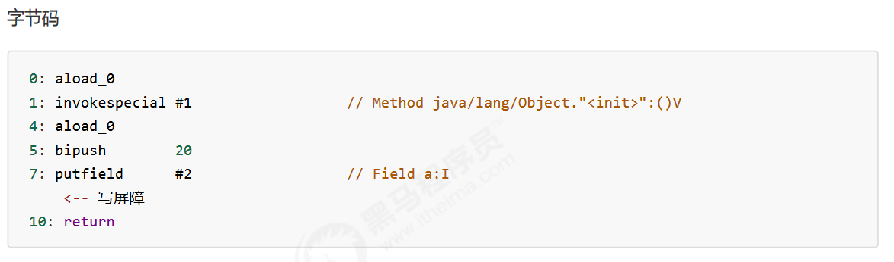

2. **获取 final 变量的原理** 

Monitor 原理 

Monitor 被翻译为监视器或管程

**每个 Java 对象都可以关联一个 Monitor 对象**，如果使用 synchronized 给对象上锁（重量级）之后，该对象头的Mark Word 中就被设置指向 Monitor 对象的指针

Monitor 结构如下 

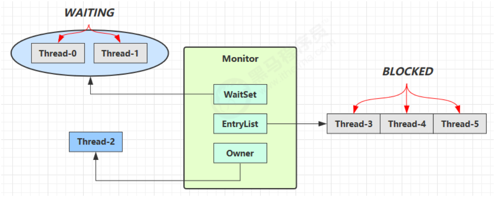

* 刚开始 Monitor 中 Owner 为 null
* 当 Thread-2 执行 synchronized(obj) 就会将 Monitor 的所有者 Owner 置为 Thread-2，Monitor中只能有一个 Owner
* 在 Thread-2 上锁的过程中，如果 Thread-3，Thread-4，Thread-5 也来执行 synchronized(obj)，就会进入EntryList BLOCKED
* Thread-2 执行完同步代码块的内容，然后唤醒 EntryList 中等待的线程来竞争锁，竞争的时是非公平的
* 图中 WaitSet 中的 Thread-0，Thread-1 是之前获得过锁，但条件不满足进入 WAITING 状态的线程，后面讲wait-notify 时会分析 

> 注意：
>
> * synchronized 必须是进入同一个对象的 monitor 才有上述的效果
>
> * 不加 synchronized 的对象不会关联监视器，不遵从以上规则 


### 2、保护性拷贝 

有同学会说，使用字符串时，也有一些跟修改相关的方法啊，比如 substring 等 

结果发现也没有，构造新字符串对象时，会生成新的 char[] value，对内容进行复制。这种通过创建副本对象来避免共享的手段称之为【保护性拷贝（defensive copy）】 

### 3、无状态 

在 web 阶段学习时，设计 Servlet 时为了保证其线程安全，都会有这样的建议，不要为 Servlet 设置成员变量，这种没有任何成员变量的类是线程安全的 

> 因为成员变量保存的数据也可以称为状态信息，因此没有成员变量就称之为【无状态】 


## 八、共享模型之工具

### 1、ThreadPoolExecutor 

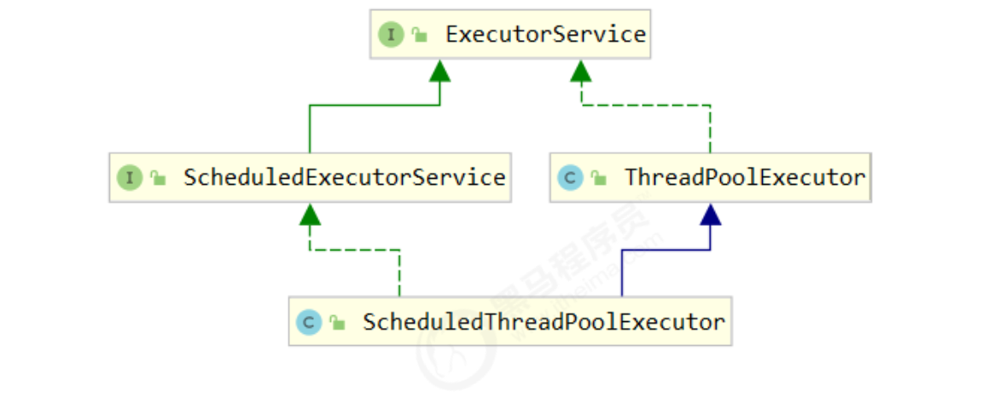


**1)线程池状态**

ThreadPoolExecutor 使用 int 的高 3 位来表示线程池状态，低 29 位表示线程数量 

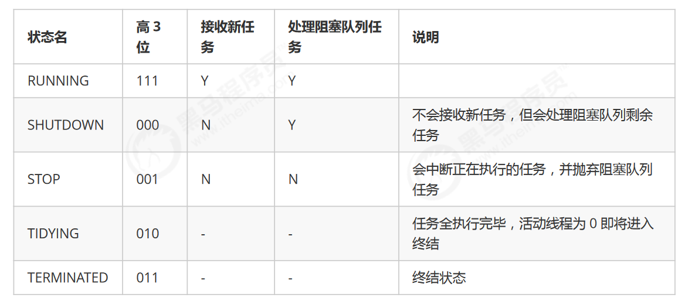

从数字上比较，TERMINATED > TIDYING > STOP > SHUTDOWN > RUNNING 

这些信息存储在一个原子变量 ctl 中，目的是将线程池状态与线程个数合二为一，这样就可以用一次 cas 原子操作进行赋值 


**2)构造方法**

```java
public ThreadPoolExecutor(intcorePool Size,
                          int maximumPoolSize,
                          long keepAliveTime,	
                          TimeUnit	unit,
                          BlockingQueue<Runnable> workQueue,
                          ThreadFactory threadFactory,
                          RejectedExecutionHandler handler)
```

* corePoolSize 核心线程数目 (最多保留的线程数)
* maximumPoolSize 最大线程数目
* keepAliveTime 生存时间 - 针对救急线程
* unit 时间单位 - 针对救急线程
* workQueue 阻塞队列
* threadFactory 线程工厂 - 可以为线程创建时起个好名字
* handler 拒绝策略 

工作方法：

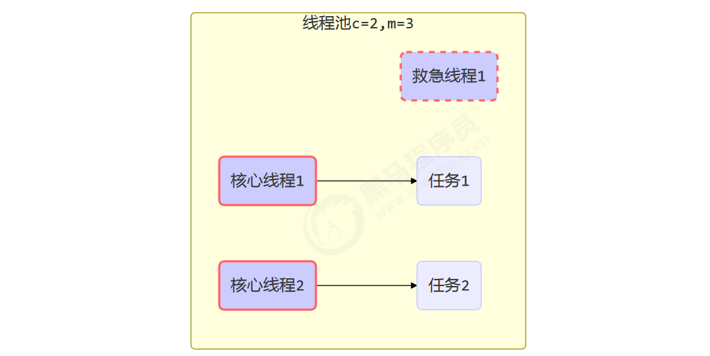


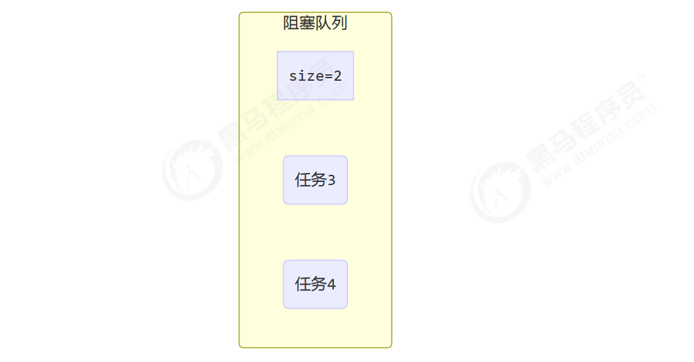

* 线程池中刚开始没有线程，当一个任务提交给线程池后，线程池会创建一个新线程来执行任务。
* 当线程数达到 corePoolSize 并没有线程空闲，这时再加入任务，新加的任务会被加入workQueue 队列排队，直到有空闲的线程。
* 如果队列选择了有界队列，那么任务超过了队列大小时，会创建 maximumPoolSize - corePoolSize 数目的线程来救急。
* 如果线程到达 maximumPoolSize 仍然有新任务这时会执行拒绝策略。**拒绝策略** jdk 提供了 4 种实现，其它著名框架也提供了实现
  * AbortPolicy 让调用者抛出 RejectedExecutionException 异常，这是默认策略 
  * CallerRunsPolicy 让调用者运行任务
  * DiscardPolicy 放弃本次任务DiscardOldestPolicy 放弃队列中最早的任务，本任务取而代之
  * Dubbo 的实现，在抛出 RejectedExecutionException 异常之前会记录日志，并 dump 线程栈信息，方便定位问题
  * Netty 的实现，是创建一个新线程来执行任务
  * ActiveMQ 的实现，带超时等待（60s）尝试放入队列，类似我们之前自定义的拒绝策略
  * PinPoint 的实现，它使用了一个拒绝策略链，会逐一尝试策略链中每种拒绝策略 
* 当高峰过去后，超过corePoolSize 的救急线程如果一段时间没有任务做，需要结束节省资源，这个时间由keepAliveTime 和 unit 来控制。 

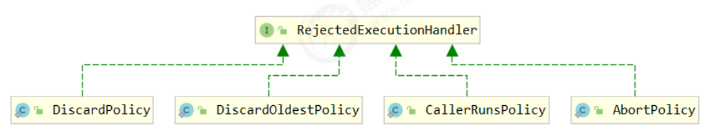

 根据这个构造方法，JDK Executors 类中提供了众多工厂方法来创建各种用途的线程池 


**3) newFixedThreadPool **

* 核心线程数 == 最大线程数（没有救急线程被创建），因此也无需超时时间
* 阻塞队列是无界的，可以放任意数量的任务

> 适用于任务量已知，相对耗时的任务 


**4) newCachedThreadPool **

* 核心线程数是 0，最大线程数是 Integer.MAX_VALUE，救急线程的空闲生存时间是 60s，意味着
  * 全部都是救急线程（60s 后可以回收）  
  * 救急线程可以无限创建
* 队列采用了 SynchronousQueue 实现特点是，它没有容量，没有线程来取是放不进去的（一手交钱、一手交货） 

 评价整个线程池表现为线程数会根据任务量不断增长，没有上限，当任务执行完毕，空闲 1分钟后释放线程。适合任务数比较密集，但每个任务执行时间较短的情况 


**5) newSingleThreadExecutor **

使用场景：希望多个任务排队执行。线程数固定为 1，任务数多于 1 时，会放入无界队列排队。任务执行完毕，这唯一的线程也不会被释放。

区别：

* 自己创建一个单线程串行执行任务，如果任务执行失败而终止那么没有任何补救措施，而线程池还会新建一个线程，保证池的正常工作
* Executors.newSingleThreadExecutor() 线程个数始终为1，不能修改
  * FinalizableDelegatedExecutorService 应用的是装饰器模式，只对外暴露了 ExecutorService 接口，因此不能调用 ThreadPoolExecutor 中特有的方法
* Executors.newFixedThreadPool(1) 初始时为1，以后还可以修改
  * 对外暴露的是 ThreadPoolExecutor 对象，可以强转后调用 setCorePoolSize 等方法进行修改 


**6) 任务调度线程池 **

在『任务调度线程池』功能加入之前，可以使用 java.util.Timer 来实现定时功能，Timer 的优点在于简单易用，但由于所有任务都是由同一个线程来调度，因此所有任务都是串行执行的，同一时间只能有一个任务在执行，前一个任务的延迟或异常都将会影响到之后的任务。 


**7) Tomcat 线程池 **

* LimitLatch 用来限流，可以控制最大连接个数，类似 J.U.C 中的  Semaphore
* Acceptor 只负责【接收新的 socket 连接】
* Poller 只负责监听 socket channel 是否有【可读的 I/O 事件】
* 一旦可读，封装一个任务对象（socketProcessor），提交给 Executor 线程池处理
* Executor 线程池中的工作线程最终负责【处理请求】 

Tomcat 线程池扩展了 ThreadPoolExecutor，行为稍有不同

* 如果总线程数达到 maximumPoolSize
  * 这时不会立刻抛 RejectedExecutionException 异常
  * 而是再次尝试将任务放入队列，如果还失败，才抛出 RejectedExecutionException 异常 


### 2、Fork/Join 

**1) 概念**

Fork/Join 是 JDK 1.7 加入的新的线程池实现，它体现的是一种分治思想，适用于能够进行任务拆分的 cpu 密集型运算

所谓的任务拆分，是将一个大任务拆分为算法上相同的小任务，直至不能拆分可以直接求解。跟递归相关的一些计算，如归并排序、斐波那契数列、都可以用分治思想进行求解

Fork/Join 在分治的基础上加入了多线程，可以把每个任务的分解和合并交给不同的线程来完成，进一步提升了运算效率

Fork/Join 默认会创建与 cpu 核心数大小相同的线程池

**2) 使用**

提交给 Fork/Join 线程池的任务需要继承 RecursiveTask（有返回值）或 RecursiveAction（没有返回值）


### 3、JUC

**AQS原理**

全称是 AbstractQueuedSynchronizer，是阻塞式锁和相关的同步器工具的框架 

特点：

* 用 state 属性来表示资源的状态（分独占模式和共享模式），子类需要定义如何维护这个状态，控制如何获取锁和释放锁
  * getState - 获取 state 状态
  * setState - 设置 state 状态
  * compareAndSetState - cas 机制设置 state 状态
  * 独占模式是只有一个线程能够访问资源，而共享模式可以允许多个线程访问资源
* 提供了基于 FIFO 的等待队列，类似于 Monitor 的 EntryList
* 条件变量来实现等待、唤醒机制，支持多个条件变量，类似于 Monitor 的 WaitSet 

 

**AQS 要实现的功能**

* 目标阻塞版本获取锁 acquire 和非阻塞的版本尝试获取锁 tryAcquire
* 获取锁超时机制 
* 通过打断取消机制
* 独占机制及共享机制
* 条件不满足时的等待机制 

**设计 ** 

获取锁的逻辑 

```java
while(state状态不允许获取) {
    if(队列中还没有此线程) {
        入队并阻塞    
    }
}当前线程出队
```

释放锁的逻辑

```java
if(state状态允许了) {
    恢复阻塞的线程(s)
}
```

**要点**

* 原子维护 state 状态
* 阻塞及恢复线程
* 维护队列

**1) state 设计**

* state 使用 volatile 配合 cas 保证其修改时的原子性
* state 使用了 32bit int 来维护同步状态，因为当时使用 long 在很多平台下测试的结果并不理想

**2) 阻塞恢复设计**

* 早期的控制线程暂停和恢复的 api 有 suspend 和 resume，但它们是不可用的，因为如果先调用的 resume 那么 suspend 将感知不到
* 解决方法是使用 park & unpark 来实现线程的暂停和恢复，具体原理在之前讲过了，先 unpark 再 park 也没问题
* **park & unpark 是针对线程的**，而不是针对同步器的，因此控制粒度更为精细
* park 线程还可以通过 interrupt 打断 

**3) 队列设计**

* 使用了 FIFO 先入先出队列，并不支持优先级队列
* 设计时借鉴了 CLH 队列，它是一种单向无锁队列 

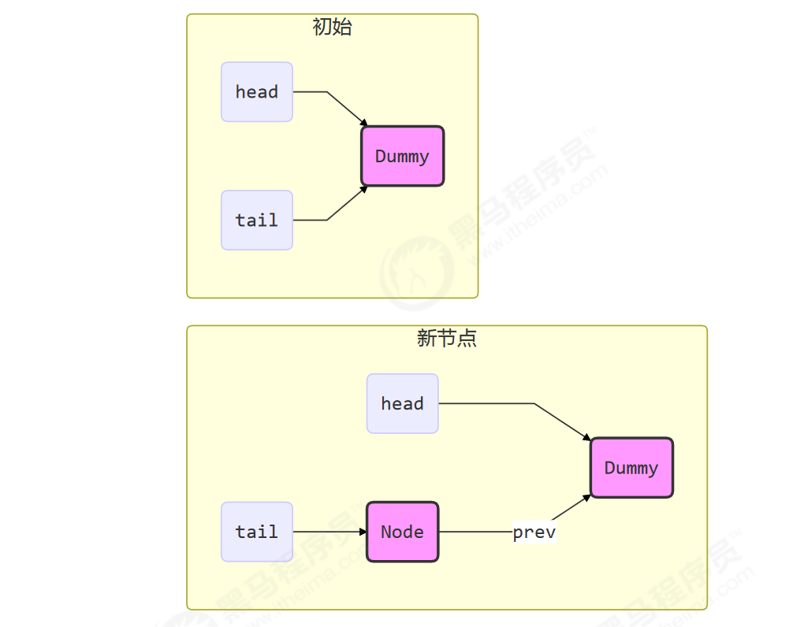

队列中有 head 和 tail 两个指针节点，都用 volatile 修饰配合 cas 使用，每个节点有 state 维护节点状态

入队伪代码，只需要考虑 tail 赋值的原子性 

```java
do {
    // 原来的 tail
    Nodeprev=tail;
    // 用 cas 在原来 tail 的基础上改为 node
} while(tail.compareAndSet(prev, node))
```

出队伪代码 

```java
// prev 是上一个节点
while((Nodeprev=node.prev).state!=唤醒状态) {   
}// 设置头节点
head=node;
```

CLH 好处：无锁，使用自旋 ；快速，无阻塞 

AQS 在一些方面改进了 CLH 

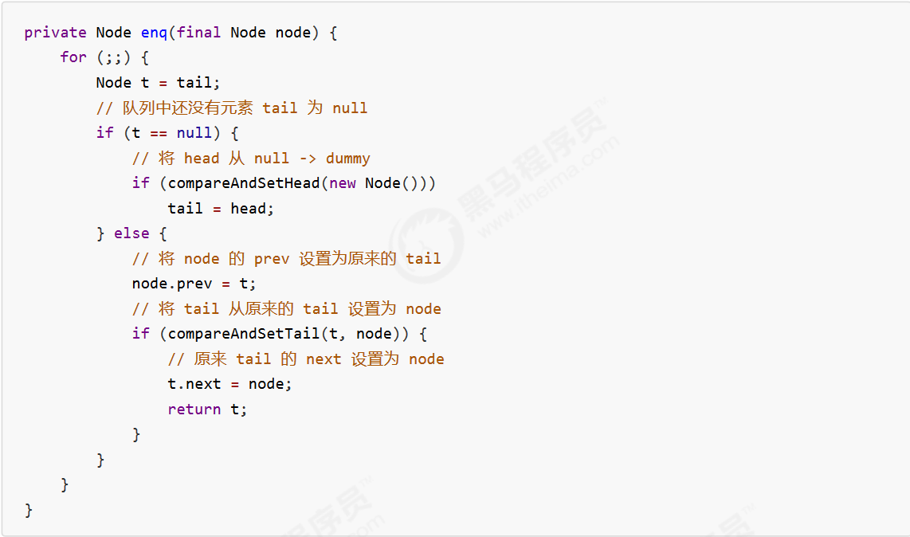


**ReentrantLock 原理 **

**①非公平锁实现原理**

加锁解锁流程先从构造器开始看，默认为非公平锁实现 

```java
public ReentrantLock() {
    sync=newNonfairSync();
}
```

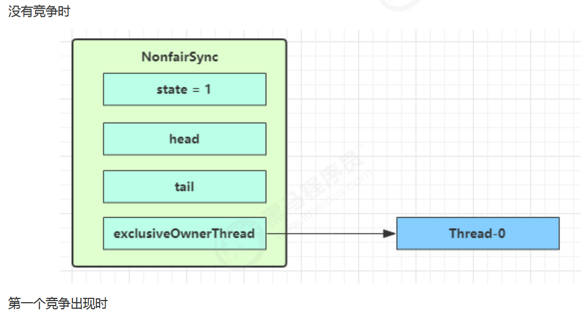

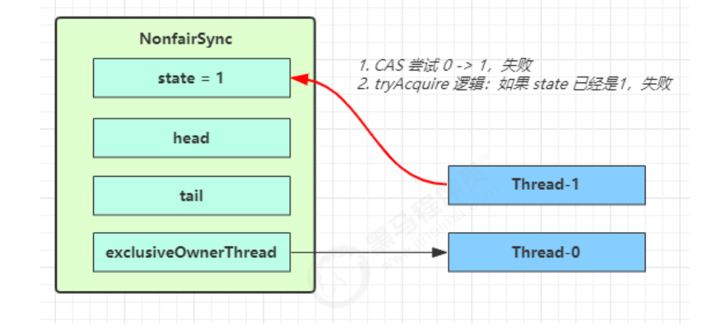

Thread-1 执行了

1. CAS 尝试将 state 由 0 改为 1，结果失败
2. 进入 tryAcquire 逻辑，这时 state 已经是1，结果仍然失败
3. 接下来进入 addWaiter 逻辑，构造 Node 队列
   * 图中黄色三角表示该 Node 的 waitStatus 状态，其中 0 为默认正常状态
   * Node 的创建是懒惰的
   * 其中第一个 Node 称为 Dummy（哑元）或哨兵，用来占位，并不关联线程 

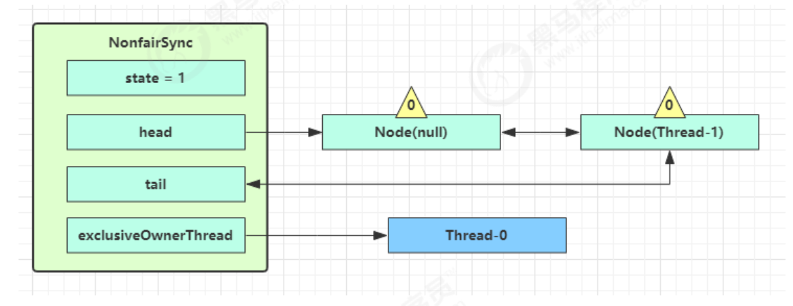

当前线程进入 acquireQueued 逻辑

1. acquireQueued 会在一个死循环中不断尝试获得锁，失败后进入 park 阻塞
2. 如果自己是紧邻着 head（排第二位），那么再次 tryAcquire 尝试获取锁，当然这时 state 仍为 1，失败
3. 进入 shouldParkAfterFailedAcquire 逻辑，将前驱 node，即 head 的 waitStatus 改为 -1，这次返回 false 

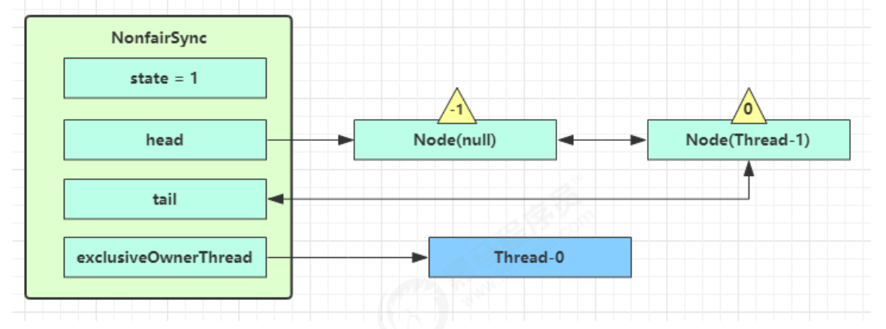

4. shouldParkAfterFailedAcquire 执行完毕回到 acquireQueued ，再次 tryAcquire 尝试获取锁，当然这时state 仍为 1，失败
5. 当再次进入 shouldParkAfterFailedAcquire 时，这时因为其前驱 node 的 waitStatus 已经是 -1，这次返回true
6. 进入 parkAndCheckInterrupt， Thread-1 park（灰色表示） 

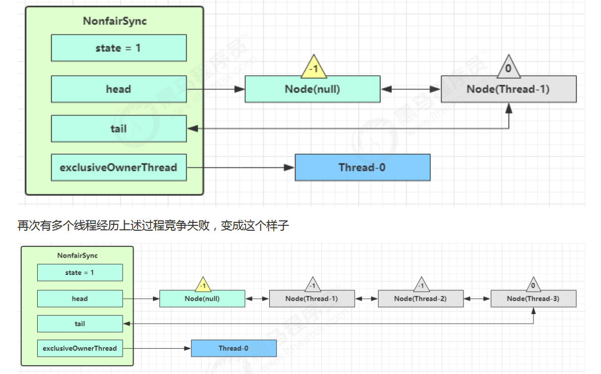

Thread-0 释放锁，进入 tryRelease 流程，如果成功

* 设置 exclusiveOwnerThread 为 null
* state = 0 

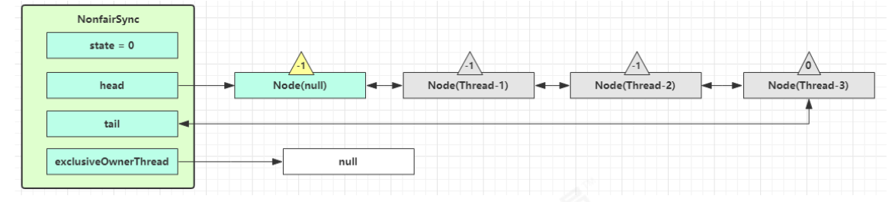

当前队列不为 null，并且 head 的 waitStatus = -1，进入 unparkSuccessor 流程找到队列中离 head 最近的一个 Node（没取消的），unpark 恢复其运行，本例中即为 Thread-1回到 Thread-1 的 acquireQueued 流程 

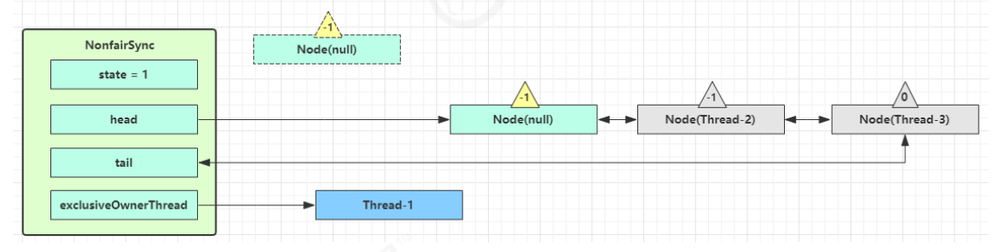

如果加锁成功（没有竞争），会设置

* exclusiveOwnerThread 为 Thread-1，state = 1
* head 指向刚刚 Thread-1 所在的 Node，该 Node 清空 Thread
* 原本的 head 因为从链表断开，而可被垃圾回收

如果这时候有其它线程来竞争（非公平的体现），例如这时有 Thread-4 来了 

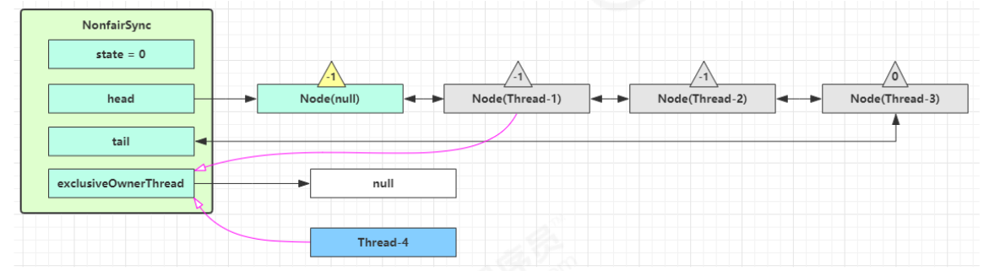

如果不巧又被 Thread-4 占了先

* Thread-4 被设置为 exclusiveOwnerThread，state = 1
* Thread-1 再次进入 acquireQueued 流程，获取锁失败，重新进入 park 阻塞 


**②可重入原理**

**③可打断原理**

**④公平锁原理**

**⑤条件变量实现原理**

*  await 流程 
*  signal 流程 

**⑦读写锁**

**ReentrantReadWriteLock**

当读操作远远高于写操作时，这时候使用读写锁让 读-读 可以并发，提高性能。类似于数据库中的select ...from ... lock in share mode

提供一个数据容器类内部分别使用读锁保护数据的read()方法，写锁保护数据的write()方法 

注意事项

* 读锁不支持条件变量
* 重入时升级不支持：即持有读锁的情况下去获取写锁，会导致获取写锁永久等待 

* 重入时降级支持：即持有写锁的情况下去获取读锁 


## PS：

并发编程：

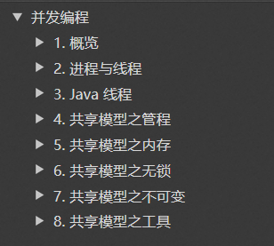

并发编程_模式：

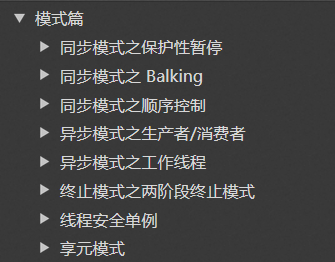

并发编程_应用：

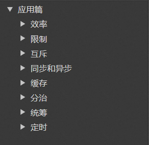

并发编程_原理：

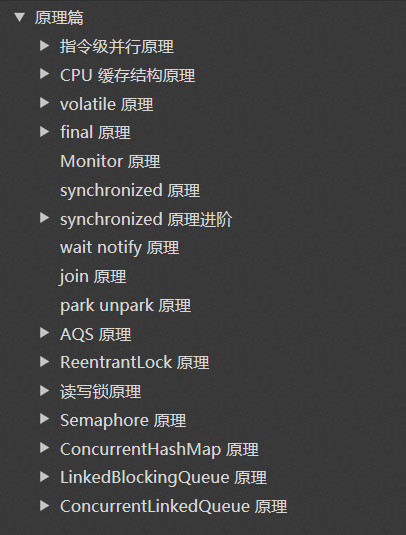