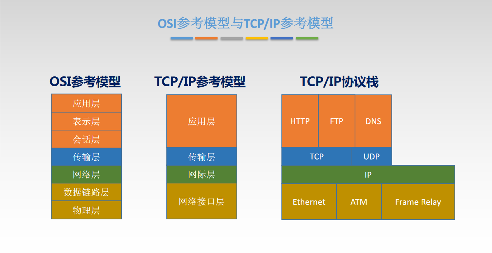
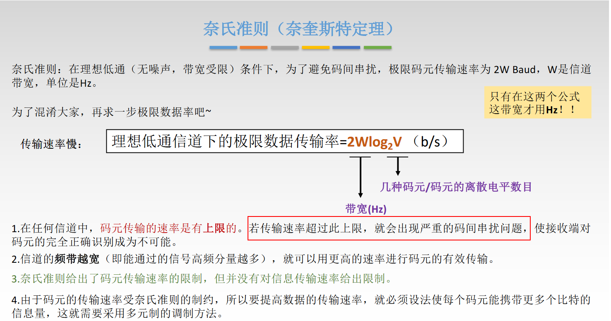
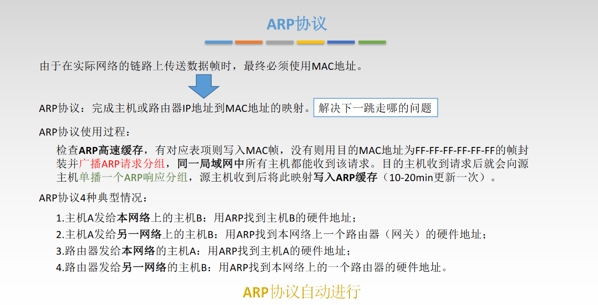
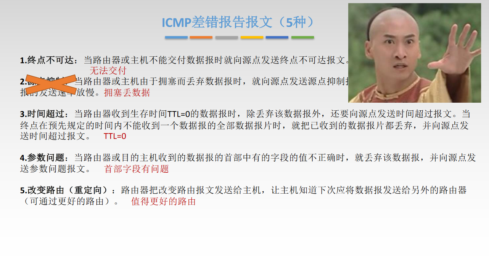
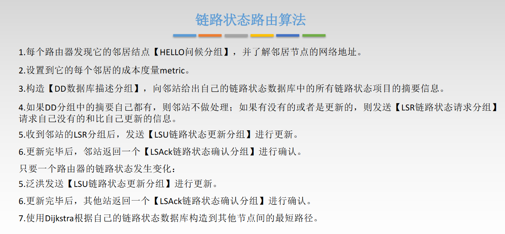
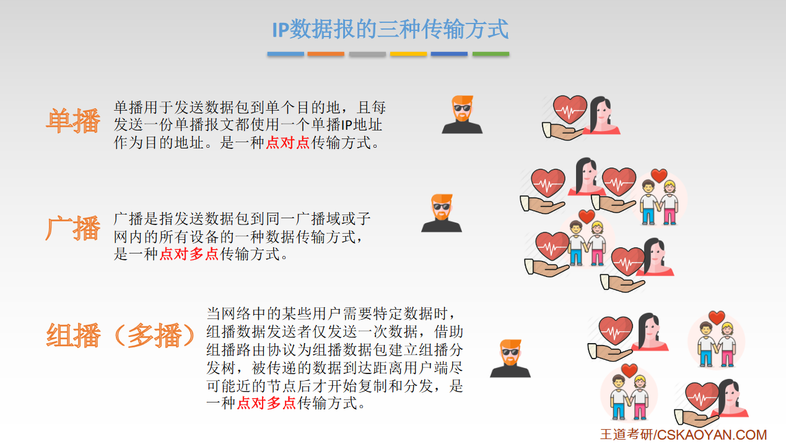
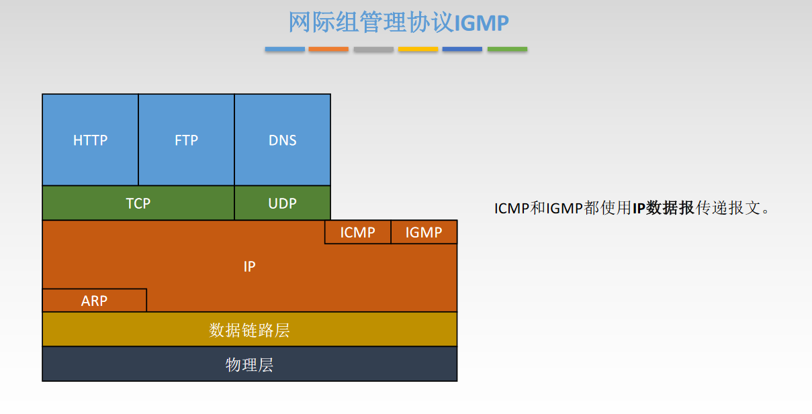
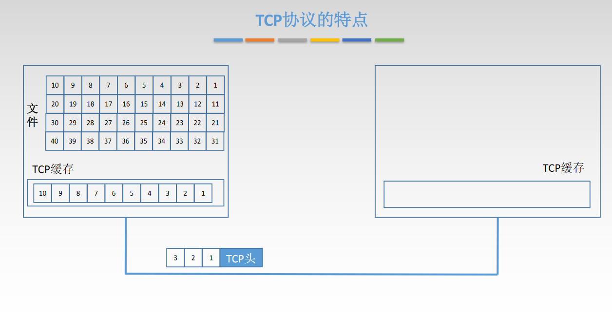

# 计算机网络

## 1、概念、组成、功能和分类

### 1、概念

计算机网络：是一个将分散的、具有独立功能的计算机网络，通过**通信设备**与**线路**连接起来，由功能完善的**软件**实现**资源共享**和**信息传递**的系统。

计算机网络是互连的，自治的。

* 互联：互联互通、通信链路
* 自治：无主从关系

### 2、功能

数据通信、资源共享、分布式处理、提高可靠性、负载均衡

### 3、组成

组成部分：硬件、软件、协议

工作方式：

* 边缘部分：用户直接使用
  * C/S方式
  * P2P方式
* 核心部分：为边缘部分服务

功能组成：

* 通信子网：实现数据通信
* 资源子网：实现资源共享 / 数据处理

资源子网：应用层、表示层、会话层

传输层

通信子网：网络层、数据链路层、物理层

### 4、分类

按分布范围：广域网WAN（交换技术）、域域网MAN、局域网LAN（广播技术）、个人区域网PAN

按使用者分：公用网、专用网

按交换技术：电路交换、报文交换、分组交换

按拓扑结构：总线型、星型、环形、网状型（广域网）

按传输技术：

* 广播式网络：共享公共通信信道
* 点对点网络：使用分组存储转发和路由选择机制

## 2、标准化工作及相关组织

标准化工作：法定标准、事实标准

## 3、速率相关的性能指标

### 1、速率

数据传输率，连接在计算机网络上的主机在数字通道上传送数据位数的速率，比如：1kb/s=10^3b/s（这里用的是10的三次方，同时单位kb为小写，单位为bit）

存储容量：1Btte（字节）= 8bit（比特）

1KB=2^10B（这里用的是2的十次方，同时单位KB为大写）

### 2、带宽

计算机网络中，带宽用来表示网络的 通信线路传送数据的能力，通常是指单位时间内从网络中的某一点到另一个点所能通过的"最高数据率"。单位是"比特每秒"，b/s。

比如链路带宽为1Mb/s，1秒可以向链路传送1bit

那么链路带宽为2Mb/s，1秒可以向链路传送2bit

### 3、吞吐量

表示单位时间内通过某个网络（或信道、接口）的数据量、单位为b/s、kb/s、Mb/s等。

假设服务器A、B在一秒内向交换机分别传递20Mb、10Mb，那么吞吐量为30Mb/s

## 4、时延、时延带宽积、RTT和利用率

### 1、时延

指数据（报文/分组/比特流）从网络（或链路）的一段传送到另一端所需的时间。也叫延迟或迟延，单位是秒。

### 2、时延带宽积

以比特为单位计算的链路长度，即"某段链路可以容纳多少比特"

### 3、往返时延RTT

从发送方发送数据开始，到发送方接收到接收方的确认（接收方收到数据后立即发送确认），总共经历的时延

### 4、利用率

信道利用率、网络利用率

## 5、分层结构、协议、接口、服务

### 为什么要分层？

发送文件前要完成的工作：

* 发起通信的计算机必须将数据通信的通路进行激活
* 要告诉网络如何识别目的主机
* 发起通信的计算机要查明目的主机是否开机，并且网络连接正常
* 发起通信的计算机要弄清楚，对方计算机中文件管理程序是否已经做好准备
* 确保差错和意外可以解决

### 分层的基本原则

1. 各层之间相互独立，每次只实现一种相对独立的功能
2. 每层之间界面清晰自然，相互交流尽可能少
3. 结构上可分割
4. 保持下层对上层的独立性，上层单向使用下层提供的服务
5. 整个分层结构应该能促进标准化工作

### 认识分层结构

1. 实体：第n层中的活动元素称为n层实体。同一层的实体叫做对等实体。
2. 协议：为进行网络中的对等实体数据交换而建立的规则、标准或约定，称为网络协会
   * 语法：规定传输数据的格式
   * 语义：规定所要完成的功能
   * 同步：规定各种操作的顺序
3. 接口：上层使用下层服务的入口
4. 服务：下层为上相邻上层提供的功能调用

SDU服务数据单元：为完成用户所要求的功能而应传送的数据（原始数据）

PCI协议控制信息：控制协议操作的信息（在每一层都添加包装的协议信息）

PDU协议数据单元：对等层次之间传送的数据单位（SUD+PCI=PDU，这个PDU会成为下一层的SDU）

## 6、OSI参考模型

### 1、参考模型

应用层 （ 资源子网 --> ）

表示层

会话层 （ <-- 资源子网 ：数据处理 ）

传输层

网络层（ 通信子网 --> ）

数据链路层

物理层（ <-- 通信子网 ：数据通信 ）

从下至上口诀：物联网淑惠试用

### 2、参考模型解释通信过程

## 7、TCP、IP参考模型和5层参考模型

### 1、TCP/IP参考模型

### 2、异同点

相同点：

* 都分层
* 基于独立的协议栈的概念
* 可以实现异构网络互连

不同点：

### 3、5层参考模型

# --------------------------------

# 物理层

## 1、基本概念

物理层解决如何在连接各种计算机的传输媒体上 **传输数据比特流**，而不是指具体的传输媒体

物理层的主要任务：确定与传输媒体接口有关的一些特性（定义标准）：机械特性、电气特性、功能特性、规程特性

## 2、数据通信基础知识

### 1、典型的数据通信模型

### 2、数据通信的相关术语

通信的目的是传送消息（消息：语言、文字、图像、视频等）

数据data：传送信息的实体，通常是有意义符号序列

信号：数据的电气/电磁的表现，是数据在传输过程中的存在形式

### 3、通信系统的通信方式

1. 单工通信
2. 半双工通信 / 双向交替通信 
3. 全双工通信 / 双向同时通信

### 4、串行传输与并行传输

### 5、同步传输与异步传输

## 3、码元、波特、速率、带宽

### 1、码元

码元是指用一个固定时长的信号波形。

### 2、传输速率

速率也叫数据率，是指数据的传输速率，表示单位时间内传输的数据量。

### 3、带宽

## 4、奈氏准则和香农定理

### 1、失真

### 2、码间干扰

### 3、奈氏准则

### 4、香农定理

## 5、编码与调制

### 1、基带信号与宽带信号

基带信号（类似人说话的声音），通过宽带信号（广播增强）后发送出去的声音

### 2、编码与调制

### 3、数字数据编码为数字信号

### 4、数字数据调制为模拟信号

数字数据调制技术在发送端 将数字信号转换为模拟信号 ，而在接收端 将模拟信号还原为数字信号，分别对应于调制 解调器的调制和解调过程。

### 5、模拟数据编码为数字信号

### 6、模拟数据调制为模拟信号

### 7、脑图时刻

## 6、物理层传输介质

### 1、传输介质及分类

传输介质也称为传输媒体/传输媒介，它就是数据传输系统中在发送设备和接收设备之间的物理通路。传输媒体并不是物理层。

### 2、导向性传输介质 - 双绞线

### 3、导向性传输介质 - 同轴电缆

### 4、导向性传输介质 - 光纤

光纤通信就是利用光导纤维（简称光纤）传递光脉冲开进行通信，有光脉冲表示1，无光脉冲表示0

### 5、非导向性传输介质

### 6、脑图时刻

## 7、物理层设备

### 1、中继器

由于存在损耗，在线路上传输的信号会逐渐衰减，衰减到一定程度时将会导致信号失真，因此会导致接收错误。

中继器的作用：对信号进行**再生与还原**，对衰减的信号进行放大， 以增加信号传输的距离，延迟网络的长度。

### 2、集线器

集线器又名多口中继器

#            --------------------------------

# 数据链路层

## 1、数据链路层功能概述

### 1、研究思想

### 2、基本概念

### 3、功能概述

数据链路层 在物理层提供服务的基础上 **向网络层提供服务**，其最基本的服务 是将源自网络层来的数据可靠地 传输到 相邻节点的目标机网络层。其主要作用是 **加强物理层传输原始 比特流的功能**，将物理层提供的可能出错的物理连接改造称为 **逻辑上无差错的数据链路**，使之对网络层表现为一条无差错的链路。

## 2、封装成帧和透明传输

### 1、封装成帧

封装成帧就是在一段数据的前后部分添加到首部和尾部，这样就构成了一个帧。接收端在收到物理层上交的比特流后，就能根据首部和尾部的标记，从收到的比特流中识别帧的开始和结束。

### 2、透明传输

透明传输是指不管所传数据是什么样的比特组合，都应该能够在链路上传输。因此，链路层就"看不见"有什么妨碍数据传输的东西。

### 3、字符计数法

### 4、字符填充法

### 5、零比特填充法

### 6、违规编码法

## 3、差错控制（检错编码）

### 1、差错的源头

概括来说，传输中的差错都是由于噪声引起。

### 2、差错控制

### 3、检查编码 - 奇偶校验码

### 4、检查编码 - CRC循环冗余码

## 4、差错控制（纠错编码）

## 5、流量控制与可靠性传输机制

### 1、流量控制

### 2、流量控制的方法

### 3、各方法的区别

## 6、停止 - 等待 协议

## 7、选择重传协议（SR）

### 1、GBN的弊端

### 2、滑动窗口

### 3、SR发送方响应

## 8、后退N帧协议（GBN）

## 9、信道划分介质访问控制

### 1、数据传输的两种链路

### 2、介质访问控制

### 3、信道划分介质访问控制

## 10、ALOHA协议

## 11、CSMA协议

## 12、轮询访问介质访问控制

## 13、CSMA-CA协议

## 14、局域网基本概念和体系结构

## 15、以太网

## 16、无线局域网

## 17、CSMA-CD协议

## 18、PPP协议和HDLC协议

## 19、链路层设备

#            --------------------------------

# 网络层

## 1、功能概述

## 2、电路交换、报文交换、分组交换

## 3、数据报与虚电路

## 4、数据交换方式

## 5、路由算法与路由协议概述

## 6、IP数据报格式

## 7、IP数据报分片

## 8、IPv4地址

## 9、网络地址转换NAT

## 10、子网划分与子网掩码

## 11、无分类编址CIDR

## 12、ARP协议

## 13、DHCP协议

## 14、ICMP协议

## 15、IPv6协议

## 16、RIP协议与距离向量算法

## 17、OSPF协议与链路状态算法

## 18、BGP协议

## 19、IP组播

## 20、移动IP

## 21、网络层设备

#            --------------------------------

# 传输层

## 1、概述

## 2、UDP协议

## 3、TCP协议

## 4、TCP可靠传输

## 5、TCP流量控制

## 6、TCP阻塞控制

#            --------------------------------

# 应用层

## 1、网络应用模型

## 2、DNS系统

## 3、文件传输协议FTP

## 4、电子邮件

## 5、万维网和HTTP协议

